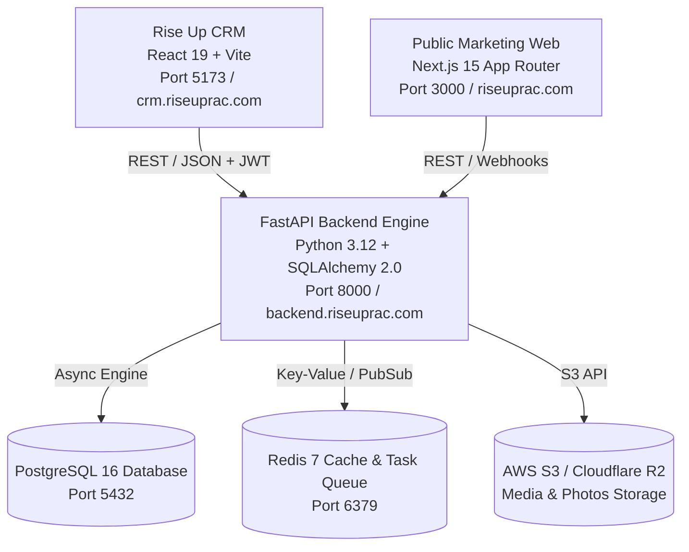

# Rise Up Roofing & Solar — Backend Integration Notes & Architectural Specification

This document is the living architectural master reference for connecting the **Rise Up CRM Frontend** (`crm/`) to the **FastAPI Backend** (`backend/`). Every module documented here provides complete database schemas, SQL DDL, REST API endpoints, Pydantic data contracts, and client-side integration patterns.

---

## Table of Contents
1. [System Architecture & Multi-Client Topology](#1-system-architecture--multi-client-topology)
2. [Global Conventions & Standards](#2-global-conventions--standards)
3. [Module 1: CRM Page Hero Banners & Live Customizer](#3-module-1-crm-page-hero-banners--live-customizer)
   - [3.1 Purpose & Architectural Overview](#31-purpose--architectural-overview)
   - [3.2 Database Schema & SQL DDL](#32-database-schema--sql-ddl)
   - [3.3 SQLAlchemy 2.0 ORM Model](#33-sqlalchemy-20-orm-model)
   - [3.4 Pydantic Schemas (Contracts)](#34-pydantic-schemas-contracts)
   - [3.5 REST API Endpoint Specifications](#35-rest-api-endpoint-specifications)
   - [3.6 FastAPI Controller Implementation](#36-fastapi-controller-implementation)
   - [3.7 Image Upload & Cloud Storage Pipeline](#37-image-upload--cloud-storage-pipeline)
   - [3.8 Caching & Cache Invalidation Strategy](#38-caching--cache-invalidation-strategy)
   - [3.9 Frontend Hybrid Client & Resilient Fallback](#39-frontend-hybrid-client--resilient-fallback)
4. [Module 2: Weather Service & Real-Time Coastal Meteorological API](#4-module-2-weather-service--real-time-coastal-meteorological-api)
   - [4.1 Backend Architecture & Required Endpoints](#41-backend-architecture--required-endpoints)
   - [4.2 REST Endpoints](#42-rest-endpoints)
   - [4.3 Python Service Code Pattern](#43-python-service-code-pattern-backendappservicesweatherpy)
   - [4.4 Frontend Implementation & Standalone Glowing Icons](#44-frontend-implementation--standalone-glowing-icons)
5. [Module 3: Sidebar Media & Quote Banner (Clean Image-Only & Slideshow Carousel)](#5-module-3-sidebar-media--quote-banner-clean-image-only--slideshow-carousel)
   - [5.1 Purpose & Architectural Overview](#51-purpose--architectural-overview)
   - [5.2 Database Schema & SQL DDL](#52-database-schema--sql-ddl)
   - [5.3 SQLAlchemy 2.0 ORM Models](#53-sqlalchemy-20-orm-models)
   - [5.4 Pydantic Schemas (Contracts)](#54-pydantic-schemas-contracts)
   - [5.5 REST API Endpoint Specifications](#55-rest-api-endpoint-specifications)
   - [5.6 FastAPI Controller Implementation](#56-fastapi-controller-implementation)
   - [5.7 Frontend Resilient Architecture & Local-First Fallback](#57-frontend-resilient-architecture--local-first-fallback)
6. [Module 4: Field Operations & Dispatch Calendar API](#6-module-4-field-operations--dispatch-calendar-api)
   - [6.1 Purpose & Synchronization Architecture](#61-purpose--synchronization-architecture)
   - [6.2 Database Schema & SQL DDL](#62-database-schema--sql-ddl)
   - [6.3 SQLAlchemy 2.0 ORM Models](#63-sqlalchemy-20-orm-models)
   - [6.4 Pydantic Schemas (Contracts)](#64-pydantic-schemas-contracts)
   - [6.5 REST API Endpoint Specifications](#65-rest-api-endpoint-specifications)
   - [6.6 FastAPI Controller Implementation](#66-fastapi-controller-implementation)
   - [6.7 Focused Calendar Architecture & Above-the-Fold Telemetry API](#67-focused-calendar-architecture--above-the-fold-telemetry-api)
   - [6.8 3-Item Default Stacking, Synchronized Height Lock & Internal Scrolling](#68-3-item-default-stacking-synchronized-height-lock--internal-scrolling)
   - [6.9 Frontend Synchronization & Cross-Component Integration](#69-frontend-synchronization--cross-component-integration)
7. [Module 5: User Personal To-Dos & Sticky Notes API](#7-module-5-user-personal-to-dos--sticky-notes-api)
   - [7.1 Purpose & User-Scoped Sticky Note Architecture](#71-purpose--user-scoped-sticky-note-architecture)
   - [7.2 Database Schema & SQL DDL](#72-database-schema--sql-ddl)
   - [7.3 SQLAlchemy 2.0 ORM Models](#73-sqlalchemy-20-orm-models)
   - [7.4 Pydantic Schemas (Contracts)](#74-pydantic-schemas-contracts)
   - [7.5 REST API Endpoint Specifications](#75-rest-api-endpoint-specifications)
   - [7.6 FastAPI Controller Implementation](#76-fastapi-controller-implementation)
   - [7.7 Frontend Resilient Architecture & Cross-Component Integration](#77-frontend-resilient-architecture--cross-component-integration)
8. [Upcoming Modules Roadmap](#8-upcoming-modules-roadmap)

---

## 1. System Architecture & Multi-Client Topology

The Rise Up platform consists of three core applications running in harmony:



- **Backend Framework**: Python 3.12+ with FastAPI, Async SQLAlchemy 2.0, Alembic migrations, Redis caching.
- **Frontend CRM**: React 19, TypeScript, Vite, Tailwind CSS v4, Lucide Icons, TanStack Query.
- **Authentication**: JWT Bearer tokens with Role-Based Access Control (RBAC: `admin`, `sales_rep`, `project_manager`, `estimator`, `contractor`).

---

## 2. Global Conventions & Standards

1. **Endpoint Prefixing**:
   - Public Endpoints: `/api/v1/...`
   - Admin & CRM Protected Endpoints: `/api/admin/...`
2. **Standard Response Envelopes**:
   ```json
   {
     "success": true,
     "data": { ... },
     "message": "Operation completed successfully",
     "timestamp": "2026-09-15T08:50:00Z"
   }
   ```
3. **Error Response Envelopes**:
   ```json
   {
     "success": false,
     "error": {
       "code": "ENTITY_NOT_FOUND",
       "message": "Detailed human-readable error explanation",
       "details": {}
     },
     "timestamp": "2026-09-15T08:50:00Z"
   }
   ```
4. **Dates & Timestamps**: All timestamps stored and transmitted in strict ISO 8601 UTC (`YYYY-MM-DDTHH:MM:SSZ`).
5. **Image URLs**: Must return absolute HTTPS CDN URLs (e.g., `https://assets.riseuprac.com/...`).
6. **Standardized Light-Glass Modal Design System (`crm/src/components/common/CrmModal.tsx`)**:
   All dialogs and modals in the CRM must adhere to the standardized Light-Glass design contract:
   - **Backdrop**: `fixed inset-0 z-[99999] bg-slate-950/60 backdrop-blur-md` with dual ambient caustic lights (`sky-400/20` & `amber-400/15`).
   - **Card Container**: `bg-white/95 backdrop-blur-3xl border border-white/95 shadow-[0_25px_90px_rgba(0,0,0,0.35),0_0_0_1px_rgba(255,255,255,0.9)_inset] rounded-[26px]`.
   - **Specular Bevel**: Micro 1px gradient line across top edge (`bg-gradient-to-r from-transparent via-white to-transparent`).
   - **Header**: `bg-gradient-to-r from-sky-50/60 via-slate-50/40 to-white/30 border-b border-slate-200/75` with gradient icon box (`bg-gradient-to-tr from-[#1878B8] to-[#0284c7]`), `text-slate-900` bold title, uppercase pill badge, and `w-8 h-8 rounded-full bg-slate-100/90 hover:bg-slate-200` close button.
   - **Form Inputs**: `bg-slate-50/80 hover:bg-white focus:bg-white border border-slate-200/90 focus:border-[#1878B8] focus:ring-3 focus:ring-sky-400/20 text-slate-900`.
   - **Option Chips / Pills**: Crisp light cards with colored indicator dots and active ring states.
   - **Action Bar Footer**: `border-t border-slate-200/75 bg-slate-50/50` with secondary cancel button and primary action gradient button (`bg-gradient-to-r from-[#1878B8] via-[#0284c7] to-[#38bdf8] text-white`).
   - Always wrap new modals in `<CrmModal>` or use this layout pattern to ensure 100% aesthetic consistency.

---

## 3. Module 1: CRM Page Hero Banners & Live Customizer

### 3.1 Purpose & Architectural Overview
Every primary CRM page (`Dashboard`, `Leads`, `Pipeline`, `Clients`, `Estimates`, `Calendar`, `Tasks`, `Reports`, `Settings`, `Jobs`, `Inspections`, `Finances`, `Reviews`, `Templates`, `Warranties`) renders a strictly standardized **220px high hero banner** featuring:
- Dynamic panorama background image with precision zoom and 2D pan framing.
- Adjustable liquid pearl atmospheric glass overlay.
- Design-safe copy editing with strict character limits (Eyebrow, Title, Subtitle).
- On-hover pencil customize button allowing admins to update visuals globally or per-page.

When connected to the backend, customizations are saved to PostgreSQL and cached in Redis. The frontend operates with an **optimistic local cache**: on first page load, local storage is displayed instantly (0ms delay), followed by a seamless background revalidation with the backend.

---

### 3.2 Database Schema & SQL DDL

Create the `crm_hero_banners` table in PostgreSQL:

```sql
-- Table: crm_hero_banners
CREATE TABLE IF NOT EXISTS crm_hero_banners (
    page_id VARCHAR(64) PRIMARY KEY,                 -- e.g. 'global', 'leads', 'calendar'
    image_url TEXT NOT NULL,                         -- CDN image URL or static asset path
    zoom INTEGER NOT NULL DEFAULT 100,               -- Scale percentage: 100 to 250
    position_x INTEGER NOT NULL DEFAULT 50,          -- Pan X percentage: 0 to 100
    position_y INTEGER NOT NULL DEFAULT 50,          -- Pan Y percentage: 0 to 100
    opacity INTEGER NOT NULL DEFAULT 90,             -- Photo opacity: 30 to 100
    overlay_strength INTEGER NOT NULL DEFAULT 75,    -- Pearl glass wash strength: 0 to 100
    eyebrow VARCHAR(50) NULL,                        -- Design-safe limit: max 50 chars
    title VARCHAR(36) NULL,                          -- Design-safe limit: max 36 chars
    subtitle VARCHAR(110) NULL,                      -- Design-safe limit: max 110 chars
    is_global BOOLEAN NOT NULL DEFAULT FALSE,        -- True if this is the default global fallback
    updated_by VARCHAR(64) NULL,                     -- User ID or email of last editor
    created_at TIMESTAMPTZ NOT NULL DEFAULT NOW(),
    updated_at TIMESTAMPTZ NOT NULL DEFAULT NOW()
);

-- Index for fast lookup by page_id
CREATE INDEX IF NOT EXISTS idx_crm_hero_banners_page_id ON crm_hero_banners(page_id);

-- Initial Global Default Seed Record
INSERT INTO crm_hero_banners (
    page_id,
    image_url,
    zoom,
    position_x,
    position_y,
    opacity,
    overlay_strength,
    eyebrow,
    title,
    subtitle,
    is_global,
    updated_by
) VALUES (
    'global',
    'https://images.unsplash.com/photo-1613490493576-7fde63acd811?auto=format&fit=crop&w=2400&q=85',
    100,
    92,
    50,
    90,
    75,
    'CALIFORNIA LICENSED C-39 ROOFING CONTRACTOR',
    'RISE UP ROOFING & SOLAR',
    'North County San Diego Commercial & Residential Roofing Specialists. Oceanside HQ.',
    TRUE,
    'system_seed'
) ON CONFLICT (page_id) DO NOTHING;
```

---

### 3.3 SQLAlchemy 2.0 ORM Model

Add to `backend/app/models/hero_banner.py`:

```python
from sqlalchemy import Column, String, Integer, Boolean, Text, DateTime, func
from app.core.database import Base

class HeroBanner(Base):
    __tablename__ = "crm_hero_banners"

    page_id = Column(String(64), primary_key=True, index=True)
    image_url = Column(Text, nullable=False)
    zoom = Column(Integer, nullable=False, default=100)
    position_x = Column(Integer, nullable=False, default=50)
    position_y = Column(Integer, nullable=False, default=50)
    opacity = Column(Integer, nullable=False, default=90)
    overlay_strength = Column(Integer, nullable=False, default=75)
    eyebrow = Column(String(50), nullable=True)
    title = Column(String(36), nullable=True)
    subtitle = Column(String(110), nullable=True)
    is_global = Column(Boolean, nullable=False, default=False)
    updated_by = Column(String(64), nullable=True)
    created_at = Column(DateTime(timezone=True), server_default=func.now(), nullable=False)
    updated_at = Column(DateTime(timezone=True), server_default=func.now(), onupdate=func.now(), nullable=False)
```

---

### 3.4 Pydantic Schemas (Contracts)

Add to `backend/app/schemas/hero_banner.py`:

```python
from pydantic import BaseModel, Field
from typing import Optional, Dict
from datetime import datetime

class HeroBannerBase(BaseModel):
    image_url: str = Field(..., description="CDN URL for the panoramic background image")
    zoom: int = Field(100, ge=100, le=250, description="Zoom scale percentage (100% to 250%)")
    position_x: int = Field(50, ge=0, le=100, description="Horizontal pan position (0% left to 100% right)")
    position_y: int = Field(50, ge=0, le=100, description="Vertical pan position (0% top to 100% bottom)")
    opacity: int = Field(90, ge=30, le=100, description="Background image opacity (30% to 100%)")
    overlay_strength: int = Field(75, ge=0, le=100, description="Pearl liquid wash overlay strength (0% to 100%)")
    eyebrow: Optional[str] = Field(None, max_length=50, description="Uppercase header badge text (max 50 chars)")
    title: Optional[str] = Field(None, max_length=36, description="Bold main headline text (max 36 chars)")
    subtitle: Optional[str] = Field(None, max_length=110, description="Subtitle description (max 110 chars)")

class HeroBannerSaveRequest(HeroBannerBase):
    apply_globally: bool = Field(False, description="If true, image and viewport settings apply globally to all pages")

class HeroBannerResponse(HeroBannerBase):
    page_id: str
    is_global: bool
    updated_by: Optional[str] = None
    updated_at: datetime

    class Config:
        from_attributes = True

class HeroBannerMapResponse(BaseModel):
    global_banner: HeroBannerResponse
    pages: Dict[str, HeroBannerResponse]
    cached_at: datetime

class HeroImageUploadResponse(BaseModel):
    url: str
    filename: str
    content_type: str
    size_bytes: int
```

---

### 3.5 REST API Endpoint Specifications

All endpoints require standard `Bearer <JWT_TOKEN>` authorization.

#### 1. `GET /api/admin/hero-banners`
- **Description**: Returns the entire hero configuration map (`global` settings + all per-page overrides).
- **Required Permission**: `system:read` or `dashboard:read`.
- **Response `200 OK`**:
```json
{
  "success": true,
  "data": {
    "global_banner": {
      "page_id": "global",
      "image_url": "https://assets.riseuprac.com/hero/coastal-estate.webp",
      "zoom": 100,
      "position_x": 92,
      "position_y": 50,
      "opacity": 90,
      "overlay_strength": 75,
      "eyebrow": "CALIFORNIA LICENSED C-39 ROOFING CONTRACTOR",
      "title": "RISE UP ROOFING & SOLAR",
      "subtitle": "North County San Diego Commercial & Residential Roofing Specialists.",
      "is_global": true,
      "updated_at": "2026-09-15T04:00:00Z"
    },
    "pages": {
      "leads": {
        "page_id": "leads",
        "image_url": "https://assets.riseuprac.com/hero/coastal-estate.webp",
        "zoom": 105,
        "position_x": 88,
        "position_y": 48,
        "opacity": 90,
        "overlay_strength": 75,
        "eyebrow": "INTAKE & CONVERSION PIPELINE",
        "title": "LEADS & INTAKE DIRECTORY",
        "subtitle": "Live homeowner inquiries, fast dispatch SLAs, and loss root-cause intelligence.",
        "is_global": false,
        "updated_at": "2026-09-15T04:10:00Z"
      }
    },
    "cached_at": "2026-09-15T04:15:00Z"
  }
}
```

#### 2. `GET /api/admin/hero-banners/{page_id}`
- **Description**: Returns the resolved hero banner for a specific page. If no specific override exists, returns the global configuration with page-specific default copy.
- **Response `200 OK`**: Single `HeroBannerResponse`.

#### 3. `PUT /api/admin/hero-banners/{page_id}`
- **Description**: Updates configuration for a page. If `apply_globally: true`, also updates the global banner background, framing, and atmosphere, synchronizing it across all pages.
- **Required Permission**: `admin:settings` or `system:write`.
- **Request Body**: `HeroBannerSaveRequest`.
- **Response `200 OK`**: Updated `HeroBannerResponse`.

#### 4. `DELETE /api/admin/hero-banners/{page_id}`
- **Description**: Removes per-page customizations and resets the page to inherit the global background and default text.
- **Response `200 OK`**: `{ "success": true, "message": "Page hero reset to global defaults" }`.

#### 5. `POST /api/admin/hero-banners/upload`
- **Description**: Uploads a raw photo (`image/jpeg`, `image/png`, `image/webp`, `image/avif`, max 15MB), stores it in cloud storage, and returns an optimized CDN URL.
- **Form Data**: `file: UploadFile`.
- **Response `200 OK`**:
```json
{
  "success": true,
  "data": {
    "url": "https://assets.riseuprac.com/hero/uploads/hero_20260915_a81f3d.webp",
    "filename": "hero_20260915_a81f3d.webp",
    "content_type": "image/webp",
    "size_bytes": 482190
  }
}
```

---

### 3.6 FastAPI Controller Implementation

Add to `backend/app/api/admin/hero_banners.py`:

```python
from fastapi import APIRouter, Depends, HTTPException, UploadFile, File, status
from sqlalchemy.ext.asyncio import AsyncSession
from sqlalchemy import select
from typing import Dict, Any
import uuid

from app.core.database import get_db
from app.core.redis import get_redis
from app.core.permissions import require_permission, require_auth_user
from app.models.hero_banner import HeroBanner
from app.schemas.hero_banner import (
    HeroBannerResponse,
    HeroBannerSaveRequest,
    HeroBannerMapResponse,
    HeroImageUploadResponse,
)

router = APIRouter(prefix="/api/admin/hero-banners", tags=["Admin Hero Banners"])
REDIS_KEY = "crm:hero_banners:map"

@router.get("", response_model=Dict[str, Any])
async def get_all_hero_banners(
    user: Dict[str, Any] = Depends(require_auth_user()),
    db: AsyncSession = Depends(get_db),
    redis = Depends(get_redis),
):
    # Try Redis Cache
    cached = await redis.get(REDIS_KEY)
    if cached:
        import orjson
        return orjson.loads(cached)

    result = await db.execute(select(HeroBanner))
    rows = result.scalars().all()
    
    global_banner = None
    pages_map = {}
    
    for row in rows:
        serialized = HeroBannerResponse.model_validate(row).model_dump()
        if row.page_id == "global" or row.is_global:
            global_banner = serialized
        else:
            pages_map[row.page_id] = serialized

    response_payload = {
        "success": True,
        "data": {
            "global_banner": global_banner,
            "pages": pages_map,
        }
    }
    
    import orjson
    await redis.setex(REDIS_KEY, 300, orjson.dumps(response_payload))
    return response_payload


@router.put("/{page_id}", response_model=Dict[str, Any])
async def update_hero_banner(
    page_id: str,
    payload: HeroBannerSaveRequest,
    user: Dict[str, Any] = Depends(require_permission("system:write")),
    db: AsyncSession = Depends(get_db),
    redis = Depends(get_redis),
):
    # 1. Update / Create the Page Record
    result = await db.execute(select(HeroBanner).where(HeroBanner.page_id == page_id))
    banner = result.scalar_one_or_none()
    
    if not banner:
        banner = HeroBanner(page_id=page_id)
        db.add(banner)
        
    banner.image_url = payload.image_url
    banner.zoom = payload.zoom
    banner.position_x = payload.position_x
    banner.position_y = payload.position_y
    banner.opacity = payload.opacity
    banner.overlay_strength = payload.overlay_strength
    banner.eyebrow = payload.eyebrow
    banner.title = payload.title
    banner.subtitle = payload.subtitle
    banner.updated_by = user.get("sub") or user.get("email", "admin")

    # 2. If Apply Globally is checked, also update 'global' record
    if payload.apply_globally:
        global_res = await db.execute(select(HeroBanner).where(HeroBanner.page_id == "global"))
        g_banner = global_res.scalar_one_or_none()
        if not g_banner:
            g_banner = HeroBanner(page_id="global", is_global=True)
            db.add(g_banner)
        g_banner.image_url = payload.image_url
        g_banner.zoom = payload.zoom
        g_banner.position_x = payload.position_x
        g_banner.position_y = payload.position_y
        g_banner.opacity = payload.opacity
        g_banner.overlay_strength = payload.overlay_strength
        g_banner.updated_by = banner.updated_by

    await db.commit()
    await db.refresh(banner)
    await redis.delete(REDIS_KEY)

    return {
        "success": True,
        "data": HeroBannerResponse.model_validate(banner).model_dump(),
        "message": f"Hero banner for '{page_id}' saved successfully"
    }


@router.post("/upload", response_model=Dict[str, Any])
async def upload_hero_image(
    file: UploadFile = File(...),
    user: Dict[str, Any] = Depends(require_permission("system:write")),
):
    # Allowed mime types
    allowed = ["image/jpeg", "image/png", "image/webp", "image/avif"]
    if file.content_type not in allowed:
        raise HTTPException(
            status_code=status.HTTP_400_BAD_REQUEST,
            detail=f"Unsupported format {file.content_type}. Use JPG, PNG, WebP, or AVIF."
        )

    # In production, stream to S3/Cloudflare R2.
    # Fallback to local uploads dir in local dev.
    import os
    ext = file.filename.split(".")[-1] if "." in file.filename else "webp"
    unique_name = f"hero_{uuid.uuid4().hex[:10]}.{ext}"
    upload_dir = os.path.join(os.path.dirname(__file__), "..", "..", "static", "uploads", "hero")
    os.makedirs(upload_dir, exist_ok=True)
    
    file_path = os.path.join(upload_dir, unique_name)
    content = await file.read()
    with open(file_path, "wb") as f:
        f.write(content)

    public_url = f"/static/uploads/hero/{unique_name}"
    return {
        "success": True,
        "data": {
            "url": public_url,
            "filename": unique_name,
            "content_type": file.content_type,
            "size_bytes": len(content),
        }
    }
```

---

### 3.7 Image Upload & Cloud Storage Pipeline

When connected to AWS S3 / Cloudflare R2 / Supabase Storage:
1. File uploaded via multipart form.
2. Compressed to WebP (85% quality) via Python Pillow on the backend.
3. Uploaded to S3 bucket `riseup-assets/hero/`.
4. Returns edge CDN URL (`https://assets.riseuprac.com/hero/...`).
5. **No large Base64 blobs** stored in the database or client storage!

---

### 3.8 Caching & Cache Invalidation Strategy
- **Redis Key**: `crm:hero_banners:map`
- **TTL**: 300 seconds (5 minutes).
- **Invalidation**: Every `PUT` or `DELETE` on `/api/admin/hero-banners/*` invalidates the key immediately (`redis.delete(REDIS_KEY)`), ensuring real-time cross-tab and cross-device consistency.

---

### 3.9 Frontend Hybrid Client & Resilient Fallback

The CRM frontend implements an **abstraction service layer** in [`src/api/heroBannerApi.ts`](file:///a:/Glitz/roofing/rise-up-next/crm/src/api/heroBannerApi.ts) and wraps it in [`src/lib/heroBannerStore.ts`](file:///a:/Glitz/roofing/rise-up-next/crm/src/lib/heroBannerStore.ts):

1. **Instant Paint (0ms)**: Reads from `localStorage` on initial render. Never blocks UI or causes layout shift.
2. **Background Sync**: Silently fetches `/api/admin/hero-banners`. If the backend is running and has newer records, updates client state and `localStorage` seamlessly.
3. **Resilient Offline Fallback**: If the network request fails (e.g. backend server not started), it logs a debug note and continues operating completely in local mode with zero crashes.
4. **Optimistic Saves**: When clicking "Save Changes" in the customizer modal:
   - Updates local UI immediately.
   - Dispatches `CustomEvent('crm_hero_banner_change')` to update all pages in real time.
   - Sends background `PUT` request to backend.

---

---

## 4. Module 2: Weather Service & Real-Time Coastal Meteorological API

Roofing operations are acutely weather-sensitive. Rain, wind speeds exceeding 20 mph, morning ocean fog/dew, and excessive heat directly govern shingle tear-off safety, adhesive curing, torch-down compliance, and crew dispatching.

The CRM includes a **Coastal Weather Widget** in the persistent right utility panel that delivers live temperature, condition indicators, feels-like metrics, and condition-specific glowing icons without visual clutter.

---

### 4.1 Backend Architecture & Required Endpoints

> [!IMPORTANT]
> **Backend Checklist — What Must Be Created or Configured in the Backend:**
> 1. **WeatherAPI Key**: Ensure `WEATHER_API_KEY` is configured in `backend/.env`. (Free tier from [WeatherAPI.com](https://www.weatherapi.com/) provides 1M calls/month).
> 2. **Service Flexible Signature**: In `backend/app/services/weather.py`, ensure `get_weather_forecast(*args, **kwargs)` accepts `(location: str)` or `(redis, location: str)` to avoid `TypeError: positional arguments mismatch`.
> 3. **Normalized Condition Keys**: Backend should supply `condition_key` in the payload:
>    - `sunny` | `clear_night` | `partly_cloudy` | `cloudy` | `rain` | `thunderstorm` | `snow` | `fog` | `windy`
> 4. **API Route**: Verify `GET /api/admin/weather` returns a `{ "success": true, "data": { ... } }` envelope.

---

### 4.2 REST Endpoints

#### 1. `GET /api/admin/weather`
- **Query Parameters**:
  - `location` *(string, optional, default: `"Oceanside, CA"`)*: City, State, or ZIP code (e.g. `"92054"`, `"Carlsbad, CA"`).
- **Authentication**: Bearer Token or public depending on deployment policy.
- **Cache Strategy**: Redis key `weather_forecast:{location_slug}` with **30-minute TTL (1800s)**.
- **Response Format `200 OK`**:
```json
{
  "success": true,
  "data": {
    "location": "Oceanside, California",
    "localtime": "2026-09-15 09:30",
    "current": {
      "temp_f": 72,
      "feelslike_f": 74,
      "humidity": 58,
      "wind_mph": 8,
      "wind_dir": "WNW",
      "uv": 5,
      "precip_in": 0,
      "vis_miles": 10,
      "cloud": 15,
      "is_day": 1,
      "condition": {
        "text": "Sunny",
        "icon": "//cdn.weatherapi.com/weather/64x64/day/113.png",
        "code": 1000,
        "condition_key": "sunny"
      }
    },
    "forecast": [
      {
        "date": "2026-09-15",
        "maxtemp_f": 76,
        "mintemp_f": 62,
        "avgtemp_f": 69,
        "daily_chance_of_rain": 0,
        "condition": {
          "text": "Sunny",
          "condition_key": "sunny"
        },
        "sunrise": "6:29 AM",
        "sunset": "7:10 PM"
      }
    ],
    "isFallback": false
  }
}
```

---

### 4.3 Python Service Code Pattern (`backend/app/services/weather.py`)

If not yet implemented or if enhancing the existing service, use this pattern:

```python
import httpx
import orjson
from typing import Dict, Any
from app.core.config import settings
from app.core.redis import cache_get, cache_set

def normalize_condition_key(text: str, is_day: int = 1) -> str:
    t = (text or "").lower()
    if not is_day and ("clear" in t or "sunny" in t):
        return "clear_night"
    if "sun" in t or "clear" in t:
        return "sunny"
    if "partly" in t:
        return "partly_cloudy"
    if "thunder" in t or "storm" in t or "lightning" in t:
        return "thunderstorm"
    if "rain" in t or "drizzle" in t or "shower" in t:
        return "rain"
    if "snow" in t or "blizzard" in t:
        return "snow"
    if "fog" in t or "mist" in t:
        return "fog"
    if "wind" in t or "breeze" in t:
        return "windy"
    if "cloud" in t or "overcast" in t:
        return "cloudy"
    return "sunny" if is_day else "clear_night"

async def get_weather_forecast(*args, **kwargs) -> Dict[str, Any]:
    # Extract location flexibly across positional or keyword arguments
    location = kwargs.get("location") or (args[1] if len(args) >= 2 and isinstance(args[1], str) else (args[0] if len(args) >= 1 and isinstance(args[0], str) else "Oceanside, CA"))
    
    cache_key = f"weather_forecast:{location.lower().replace(' ', '_')}"
    cached = await cache_get(cache_key)
    if cached:
        try:
            return orjson.loads(cached)
        except Exception:
            pass

    api_key = getattr(settings, "WEATHER_API_KEY", None)
    if not api_key:
        return FALLBACK_WEATHER

    url = f"https://api.weatherapi.com/v1/forecast.json?key={api_key}&q={location}&days=3&aqi=no&alerts=no"
    async with httpx.AsyncClient(timeout=4.0) as client:
        resp = await client.get(url)
        if resp.status_code != 200:
            return FALLBACK_WEATHER
        raw = resp.json()
        current = raw.get("current", {})
        loc = raw.get("location", {})
        forecast_days = raw.get("forecast", {}).get("forecastday", [])
        is_day = current.get("is_day", 1)
        cond_text = current.get("condition", {}).get("text", "Sunny")
        
        shaped = {
            "location": f"{loc.get('name')}, {loc.get('region')}",
            "localtime": loc.get("localtime"),
            "current": {
                "temp_f": round(current.get("temp_f", 72)),
                "feelslike_f": round(current.get("feelslike_f", 70)),
                "humidity": current.get("humidity", 50),
                "wind_mph": round(current.get("wind_mph", 5)),
                "is_day": is_day,
                "condition": {
                    "text": cond_text,
                    "condition_key": normalize_condition_key(cond_text, is_day),
                }
            },
            "forecast": [
                {
                    "date": fd.get("date"),
                    "maxtemp_f": round(fd.get("day", {}).get("maxtemp_f", 75)),
                    "mintemp_f": round(fd.get("day", {}).get("mintemp_f", 60)),
                    "condition": {
                        "text": fd.get("day", {}).get("condition", {}).get("text", "Sunny"),
                        "condition_key": normalize_condition_key(fd.get("day", {}).get("condition", {}).get("text", "Sunny"), 1),
                    }
                }
                for fd in forecast_days
            ],
            "isFallback": False
        }
        await cache_set(cache_key, orjson.dumps(shaped).decode("utf-8"), ttl_seconds=1800)
        return shaped
```

---

### 4.4 Frontend Implementation & Standalone Glowing Icons

The frontend has been completely engineered with:
1. **Frontend API Client**: [`crm/src/api/weatherApi.ts`](file:///a:/Glitz/roofing/rise-up-next/crm/src/api/weatherApi.ts)
   - Fetches `/api/admin/weather?location={location}` with a 3.0s timeout and silent development fallback.
   - Temperature conversion utilities `fToC` and `cToF`.
   - Condition normalizer mapping 30+ WeatherAPI text variations to 9 core icon keys.
2. **Reactive Local-First Store**: [`crm/src/lib/weatherStore.ts`](file:///a:/Glitz/roofing/rise-up-next/crm/src/lib/weatherStore.ts)
   - **0ms Instant Load**: Reads last-known weather and user customizations from `localStorage`.
   - **Background Revalidation**: Fetches fresh data on initial render.
   - **Cross-Component / Tab Sync**: Dispatches `crm_weather_change` events.
3. **Standalone Glowing Weather Icons (No Background Box)**:
   - In [`crm/src/components/common/WeatherCustomizerModal.tsx`](file:///a:/Glitz/roofing/rise-up-next/crm/src/components/common/WeatherCustomizerModal.tsx), `<WeatherConditionIcon />` renders standalone icons:
     - `Sunny`: Golden amber `#F59E0B` with `drop-shadow-[0_4px_18px_rgba(245,158,11,0.75)]` and subtle spin animation.
     - `Clear Night`: Deep indigo `#818CF8` with `drop-shadow-[0_4px_16px_rgba(129,140,248,0.7)]`.
     - `Partly Cloudy`: Golden sun with sky blue cloud.
     - `Coastal Rain`: Vibrant ocean blue `#3B82F6` with droplet highlights.
     - `Thunderstorm`: Electric gold lightning bolt with pulse glow.
     - `Winter Snow`: Crystal ice blue `#7DD3FC`.
     - `Ocean Fog / Wind`: Teal breeze `#2DD4BF`.
4. **Enhanced Background Visibility & Interactive Customizer Modal**:
   - Background image opacity increased from 80% to 95%.
   - Frosted wash reduced from 95% blinding opaque white to a balanced `35–45%` pearl liquid wash, preserving vivid truck and villa details while maintaining WCAG contrast for text.
   - Hovering the widget reveals a `<Pencil />` icon opening `WeatherCustomizerModal` with live preview, preset locations, wallpaper selector, visibility sliders, unit toggles, and condition simulation.

---

## 5. Module 3: Sidebar Media & Quote Banner (Clean Image-Only & Slideshow Carousel)

### 5.1 Purpose & Architectural Overview

The CRM right sidebar (`CrmRightPanel.tsx`) contains a motivational quote and executive media banner. In earlier revisions, this card rendered static HTML text ("Company Creed" / "PROGRESS BUILDS FREEDOM.") with a heavy white gradient overlay and palm artwork that obscured the background image.

To allow administrators to showcase custom quote artwork, brand campaigns, project milestone graphics, or high-impact team photography:
1. **Clean Image-Only Presentation**: All overlaid HTML text, icons, and white gradient fills have been completely removed. The visual graphic artwork is displayed with 100% clarity, full-bleed resolution, and natural contrast.
2. **Dual Presentation Modes**:
   - **Single Image**: Displays one selected or uploaded graphic banner.
   - **Slideshow Carousel**: Automatically cycles through an array of curated or uploaded slides on a configurable timer (e.g. 5 seconds) with pause-on-hover, interactive dot navigation, and hover arrow chevrons.
3. **Admin Live Customizer**: Hovering the card reveals a sleek `<Pencil />` button that opens `QuoteBannerCustomizerModal` with preset image libraries, direct file upload, URL import, slide reordering (up/down/delete), transition style (fade vs slide), and height options (compact 105px, balanced 128px, tall 155px).

> [!IMPORTANT]
> **Backend Implementation Status**: This module is **NOT yet implemented in the backend** (`backend/app/...`). Per engineering instructions, the frontend has been completed with an optimistic local-first caching layer (`localStorage`) and resilient fallback. When constructing the backend, implement the tables, schemas, endpoints, and controller logic detailed below.

---

### 5.2 Database Schema & SQL DDL

Create the `crm_quote_banners` and `crm_quote_banner_slides` tables in PostgreSQL:

```sql
-- 1. Main Quote Banner Configuration Table
CREATE TABLE IF NOT EXISTS crm_quote_banners (
    id VARCHAR(32) PRIMARY KEY DEFAULT 'default',    -- Singleton config ID ('default')
    mode VARCHAR(16) NOT NULL DEFAULT 'single',       -- 'single' | 'slideshow'
    single_image_url TEXT NOT NULL DEFAULT '/hero-bg.jpg',
    autoplay BOOLEAN NOT NULL DEFAULT TRUE,
    slide_duration INTEGER NOT NULL DEFAULT 5,        -- Duration in seconds (2-15)
    transition_effect VARCHAR(16) NOT NULL DEFAULT 'fade', -- 'fade' | 'slide'
    card_height VARCHAR(16) NOT NULL DEFAULT 'balanced',   -- 'compact' | 'balanced' | 'tall'
    image_fit VARCHAR(16) NOT NULL DEFAULT 'cover',        -- 'cover' | 'contain'
    link_url TEXT NULL,                               -- Optional click-through URL
    updated_at TIMESTAMPTZ NOT NULL DEFAULT NOW(),
    updated_by VARCHAR(64) NULL                       -- User ID or email of last editor
);

-- 2. Slideshow Slides Table (1-to-many relationship)
CREATE TABLE IF NOT EXISTS crm_quote_banner_slides (
    id VARCHAR(64) PRIMARY KEY,                       -- e.g. 'slide-1726394850000'
    banner_id VARCHAR(32) NOT NULL DEFAULT 'default' REFERENCES crm_quote_banners(id) ON DELETE CASCADE,
    image_url TEXT NOT NULL,                          -- CDN image URL or static asset path
    title VARCHAR(128) NULL,                          -- Optional internal slide label
    alt_text VARCHAR(256) NULL,                       -- Accessibility alt text
    sort_order INTEGER NOT NULL DEFAULT 0,            -- Display order: 0, 1, 2...
    created_at TIMESTAMPTZ NOT NULL DEFAULT NOW()
);

CREATE INDEX IF NOT EXISTS idx_quote_slides_banner ON crm_quote_banner_slides(banner_id, sort_order);

-- Seed default configuration
INSERT INTO crm_quote_banners (id, mode, single_image_url, autoplay, slide_duration, transition_effect, card_height, image_fit)
VALUES ('default', 'single', '/hero-bg.jpg', TRUE, 5, 'fade', 'balanced', 'cover')
ON CONFLICT (id) DO NOTHING;

INSERT INTO crm_quote_banner_slides (id, banner_id, image_url, title, sort_order) VALUES
('slide-1', 'default', '/hero-bg.jpg', 'Rise Up Rig & Villa', 0),
('slide-2', 'default', '/sidebar-coastal-card.jpg', 'Coastal Roofing Horizon', 1),
('slide-3', 'default', '/images/services/residential-roofing.jpg', 'Master Craftsmanship', 2),
('slide-4', 'default', '/images/services/solar-roofing.jpg', 'Clean Energy & Solar Tiles', 3)
ON CONFLICT (id) DO NOTHING;
```

---

### 5.3 SQLAlchemy 2.0 ORM Models

Place in `backend/app/models/quote_banner.py`:

```python
from datetime import datetime, timezone
from typing import List, Optional
from sqlalchemy import String, Integer, Boolean, Text, DateTime, ForeignKey
from sqlalchemy.orm import Mapped, mapped_column, relationship
from app.db.base_class import Base


class QuoteBanner(Base):
    __tablename__ = "crm_quote_banners"

    id: Mapped[str] = mapped_column(String(32), primary_key=True, default="default")
    mode: Mapped[str] = mapped_column(String(16), nullable=False, default="single")
    single_image_url: Mapped[str] = mapped_column(Text, nullable=False, default="/hero-bg.jpg")
    autoplay: Mapped[bool] = mapped_column(Boolean, nullable=False, default=True)
    slide_duration: Mapped[int] = mapped_column(Integer, nullable=False, default=5)
    transition_effect: Mapped[str] = mapped_column(String(16), nullable=False, default="fade")
    card_height: Mapped[str] = mapped_column(String(16), nullable=False, default="balanced")
    image_fit: Mapped[str] = mapped_column(String(16), nullable=False, default="cover")
    link_url: Mapped[Optional[str]] = mapped_column(Text, nullable=True)
    updated_at: Mapped[datetime] = mapped_column(
        DateTime(timezone=True),
        default=lambda: datetime.now(timezone.utc),
        onupdate=lambda: datetime.now(timezone.utc),
        nullable=False,
    )
    updated_by: Mapped[Optional[str]] = mapped_column(String(64), nullable=True)

    slides: Mapped[List["QuoteBannerSlide"]] = relationship(
        "QuoteBannerSlide",
        back_populates="banner",
        cascade="all, delete-orphan",
        order_by="QuoteBannerSlide.sort_order",
        lazy="selectin",
    )


class QuoteBannerSlide(Base):
    __tablename__ = "crm_quote_banner_slides"

    id: Mapped[str] = mapped_column(String(64), primary_key=True)
    banner_id: Mapped[str] = mapped_column(
        String(32), ForeignKey("crm_quote_banners.id", ondelete="CASCADE"), nullable=False, default="default"
    )
    image_url: Mapped[str] = mapped_column(Text, nullable=False)
    title: Mapped[Optional[str]] = mapped_column(String(128), nullable=True)
    alt_text: Mapped[Optional[str]] = mapped_column(String(256), nullable=True)
    sort_order: Mapped[int] = mapped_column(Integer, nullable=False, default=0)
    created_at: Mapped[datetime] = mapped_column(
        DateTime(timezone=True), default=lambda: datetime.now(timezone.utc), nullable=False
    )

    banner: Mapped["QuoteBanner"] = relationship("QuoteBanner", back_populates="slides")
```

---

### 5.4 Pydantic Schemas (Contracts)

Place in `backend/app/schemas/quote_banner.py`:

```python
from typing import List, Optional, Literal
from pydantic import BaseModel, Field


class QuoteSlidePayload(BaseModel):
    id: str = Field(..., description="Unique client or server generated slide identifier")
    image_url: str = Field(..., description="Absolute CDN URL or local asset path")
    title: Optional[str] = Field(None, max_length=128)
    alt_text: Optional[str] = Field(None, max_length=256)


class QuoteBannerConfigPayload(BaseModel):
    mode: Literal["single", "slideshow"] = Field("single", description="Banner display mode")
    single_image_url: str = Field(..., description="Active image for single mode")
    slides: List[QuoteSlidePayload] = Field(default_factory=list, description="Ordered slides for carousel mode")
    autoplay: bool = Field(True, description="Autoplay enabled for carousel")
    slide_duration: int = Field(5, ge=2, le=15, description="Display duration in seconds")
    transition_effect: Literal["fade", "slide"] = Field("fade")
    card_height: Literal["compact", "balanced", "tall"] = Field("balanced")
    image_fit: Literal["cover", "contain"] = Field("cover")
    link_url: Optional[str] = Field(None, description="Optional click-through URL")


class QuoteBannerResponse(BaseModel):
    success: bool = True
    data: QuoteBannerConfigPayload
    message: Optional[str] = None
```

---

### 5.5 REST API Endpoint Specifications

#### 1. `GET /api/admin/quote-banner`
- **Access**: `authenticated` (Any CRM role)
- **Caching**: Redis key `crm:quote_banner:config`, TTL 3600 seconds.
- **Response**:
```json
{
  "success": true,
  "data": {
    "mode": "single",
    "singleImageUrl": "/hero-bg.jpg",
    "slides": [
      { "id": "slide-1", "imageUrl": "/hero-bg.jpg", "title": "Rise Up Rig & Villa" },
      { "id": "slide-2", "imageUrl": "/sidebar-coastal-card.jpg", "title": "Coastal Roofing Horizon" }
    ],
    "autoplay": true,
    "slideDuration": 5,
    "transitionEffect": "fade",
    "cardHeight": "balanced",
    "imageFit": "cover",
    "linkUrl": ""
  }
}
```

#### 2. `PUT /api/admin/quote-banner`
- **Access**: `admin`, `sales_manager` (`system:write`)
- **Body**: `QuoteBannerConfigPayload`
- **Behavior**:
  1. Updates root configuration attributes in `crm_quote_banners`.
  2. Deletes existing slides for banner `default` and inserts the updated ordered slide list with explicit `sort_order`.
  3. Evicts Redis cache key `crm:quote_banner:config`.
  4. Returns saved configuration envelope.

#### 3. `POST /api/admin/quote-banner/upload`
- **Access**: `admin`, `sales_manager` (`system:write`)
- **Body**: `multipart/form-data` with `file`
- **Behavior**: Streams file to AWS S3 / Cloudflare R2 under `media/quote-banners/{uuid}.{ext}`, returns permanent HTTPS URL.

---

### 5.6 FastAPI Controller Implementation

Place in `backend/app/api/v1/endpoints/quote_banner.py`:

```python
import os
import uuid
from typing import Any, Dict
from fastapi import APIRouter, Depends, HTTPException, status, UploadFile, File
from sqlalchemy.ext.asyncio import AsyncSession
from sqlalchemy import select, delete
import orjson

from app.db.session import get_db
from app.core.security import require_permission
from app.core.redis import get_redis
from app.models.quote_banner import QuoteBanner, QuoteBannerSlide
from app.schemas.quote_banner import (
    QuoteBannerConfigPayload,
    QuoteBannerResponse,
    QuoteSlidePayload,
)

router = APIRouter(prefix="/quote-banner", tags=["Quote Banner"])
CACHE_KEY = "crm:quote_banner:config"


@router.get("", response_model=QuoteBannerResponse)
async def get_quote_banner(
    db: AsyncSession = Depends(get_db),
    redis=Depends(get_redis),
):
    # 1. Check Redis Cache
    if redis:
        cached = await redis.get(CACHE_KEY)
        if cached:
            return orjson.loads(cached)

    # 2. Query Database
    stmt = select(QuoteBanner).where(QuoteBanner.id == "default")
    result = await db.execute(stmt)
    banner = result.scalar_one_or_none()

    if not banner:
        # Create default record if first run
        banner = QuoteBanner(id="default")
        db.add(banner)
        await db.commit()
        await db.refresh(banner)

    # Transform to payload
    payload = QuoteBannerConfigPayload(
        mode=banner.mode,
        single_image_url=banner.single_image_url,
        slides=[
            QuoteSlidePayload(
                id=s.id,
                image_url=s.image_url,
                title=s.title,
                alt_text=s.alt_text,
            )
            for s in banner.slides
        ],
        autoplay=banner.autoplay,
        slide_duration=banner.slide_duration,
        transition_effect=banner.transition_effect,
        card_height=banner.card_height,
        image_fit=banner.image_fit,
        link_url=banner.link_url,
    )

    response_data = {"success": True, "data": payload.model_dump(by_alias=False)}

    # 3. Write to Cache (1 hour TTL)
    if redis:
        await redis.setex(CACHE_KEY, 3600, orjson.dumps(response_data).decode("utf-8"))

    return response_data


@router.put("", response_model=QuoteBannerResponse)
async def update_quote_banner(
    payload: QuoteBannerConfigPayload,
    db: AsyncSession = Depends(get_db),
    redis=Depends(get_redis),
    user: Dict[str, Any] = Depends(require_permission("system:write")),
):
    stmt = select(QuoteBanner).where(QuoteBanner.id == "default")
    result = await db.execute(stmt)
    banner = result.scalar_one_or_none()

    if not banner:
        banner = QuoteBanner(id="default")
        db.add(banner)

    banner.mode = payload.mode
    banner.single_image_url = payload.single_image_url
    banner.autoplay = payload.autoplay
    banner.slide_duration = payload.slide_duration
    banner.transition_effect = payload.transition_effect
    banner.card_height = payload.card_height
    banner.image_fit = payload.image_fit
    banner.link_url = payload.link_url
    banner.updated_by = user.get("id") or user.get("sub")

    # Replace slides atomically
    await db.execute(delete(QuoteBannerSlide).where(QuoteBannerSlide.banner_id == "default"))

    for idx, slide_in in enumerate(payload.slides):
        new_slide = QuoteBannerSlide(
            id=slide_in.id,
            banner_id="default",
            image_url=slide_in.image_url,
            title=slide_in.title,
            alt_text=slide_in.alt_text,
            sort_order=idx,
        )
        db.add(new_slide)

    await db.commit()
    await db.refresh(banner)

    # Invalidate cache
    if redis:
        await redis.delete(CACHE_KEY)

    return {
        "success": True,
        "data": payload.model_dump(),
        "message": "Quote banner updated successfully",
    }


@router.post("/upload")
async def upload_quote_image(
    file: UploadFile = File(...),
    user: Dict[str, Any] = Depends(require_permission("system:write")),
):
    allowed = ["image/jpeg", "image/png", "image/webp", "image/avif"]
    if file.content_type not in allowed:
        raise HTTPException(
            status_code=status.HTTP_400_BAD_REQUEST,
            detail=f"Unsupported format {file.content_type}. Use JPG, PNG, WebP, or AVIF.",
        )

    # Stream to storage (S3 / Cloudflare R2 / Local dev)
    file_ext = file.filename.split(".")[-1] if "." in file.filename else "jpg"
    unique_name = f"quote_{uuid.uuid4().hex[:12]}.{file_ext}"

    # In local dev environment:
    upload_dir = "static/uploads/quotes"
    os.makedirs(upload_dir, exist_ok=True)
    file_path = os.path.join(upload_dir, unique_name)

    content = await file.read()
    with open(file_path, "wb") as f:
        f.write(content)

    public_url = f"/uploads/quotes/{unique_name}"
    return {
        "success": True,
        "data": {"url": public_url},
        "message": "Image uploaded successfully",
    }
```

---

### 5.7 Frontend Resilient Architecture & Local-First Fallback

The frontend is fully implemented and operational across four specialized layers:
1. **API Client (`crm/src/api/quoteBannerApi.ts`)**:
   - `fetchQuoteBannerFromBackend()`: Connects to `GET /api/admin/quote-banner` with 3-second timeout and silent local fallback.
   - `saveQuoteBannerToBackend(payload)`: Connects to `PUT /api/admin/quote-banner`.
   - `uploadQuoteBannerImage(file)`: Connects to `POST /api/admin/quote-banner/upload` with local Base64 fallback.
2. **State Store (`crm/src/lib/quoteBannerStore.ts`)**:
   - Manages single vs slideshow modes, slides list, duration, transition effects, height, and fit.
   - **0ms Instant Load**: Initial render displays `localStorage` state immediately with zero layout shift or network lag.
   - **Cross-Component Sync**: Dispatches `crm_quote_banner_change` events across windows and components.
   - **Automatic Carousel Logic**: Manages interval timer, pause-on-hover, and index bounds safety.
3. **Widget View (`crm/src/components/common/QuoteBannerWidget.tsx`)**:
   - Replaces the hardcoded company creed card in `CrmRightPanel.tsx`.
   - Displays pure, full-bleed images with **zero text overlay** and **zero gradient wash**.
   - Hover reveals customize `<Pencil />` button in top-right.
   - For slideshows, provides previous/next chevrons and interactive bottom dot pills.
4. **Customization Modal (`crm/src/components/common/QuoteBannerCustomizerModal.tsx`)**:
   - Interactive live preview matching sidebar dimensions.
   - 3 tabs: Presentation Mode & Presets, Slides Manager, Presentation & Timing.
   - Drag-and-drop / file upload, URL import, reorder slides, and height selectors.

## 6. Module 4: Field Operations & Dispatch Calendar API

### 6.1 Purpose & Synchronization Architecture

The **Field Operations & Dispatch Calendar** coordinates daily field workflows across North County San Diego jobsites:
- **Full Operational Workspace (`/calendar`)**: Month Grid and Team Swimlanes views with assignee filtering, weather safety advisories, and day-by-day inspector panels.
- **Persistent Sidebar Cockpit (`SidebarScheduleWidget.tsx`)**: High-priority scheduling strip embedded in the right sidebar (`CrmRightPanel.tsx`). Renders:
  - 5-day work week strip (`MON 8` through `FRI 12`) with active gradient selection.
  - Multi-colored dynamic category dots showing scheduled operations.
  - Live dispatch cards featuring glowing pulsing `NOW` indicators for active meetings or in-progress dispatches.
  - Expandable / collapsible day list with direct status toggling (`completed` vs `scheduled`).

> [!IMPORTANT]
> **Backend Implementation Status**: This module is **NOT yet implemented in the backend** (`backend/app/...`). The frontend has been engineered with an optimistic local-first caching layer (`localStorage`) and resilient fallback. When constructing the backend, implement the database tables, ORM models, Pydantic schemas, and FastAPI routes detailed below.

---

### 6.2 Database Schema & SQL DDL

Create the `crm_crews` and `crm_calendar_events` tables in PostgreSQL:

```sql
-- 1. Field Crews & Equipment Resources Table
CREATE TABLE IF NOT EXISTS crm_crews (
    id VARCHAR(32) PRIMARY KEY,                       -- e.g. 'crew-alpha', 'boom-abc'
    name VARCHAR(128) NOT NULL,
    lead VARCHAR(64) NOT NULL,
    phone VARCHAR(32) NOT NULL,
    specialty VARCHAR(128) NOT NULL,
    members_count INTEGER NOT NULL DEFAULT 4,
    vehicle VARCHAR(128) NOT NULL,
    avatar_color VARCHAR(64) NOT NULL DEFAULT 'from-sky-500 to-blue-600',
    status VARCHAR(16) NOT NULL DEFAULT 'active',     -- 'active' | 'standby' | 'off_duty'
    created_at TIMESTAMPTZ NOT NULL DEFAULT NOW()
);

-- 2. Dispatch Calendar Events Table
CREATE TABLE IF NOT EXISTS crm_calendar_events (
    id VARCHAR(64) PRIMARY KEY,                       -- e.g. 'evt-11-meeting', 'evt-18-1'
    title VARCHAR(256) NOT NULL,
    job_code VARCHAR(32) NULL,
    customer_name VARCHAR(128) NOT NULL,
    phone VARCHAR(32) NULL,
    email VARCHAR(128) NULL,
    address TEXT NOT NULL,
    city VARCHAR(64) NOT NULL,
    date DATE NOT NULL,                               -- '2026-09-11'
    day_number INTEGER NOT NULL,                      -- 11
    month INTEGER NOT NULL,                           -- 9
    year INTEGER NOT NULL,                            -- 2026
    start_time VARCHAR(16) NOT NULL,                  -- '01:30 PM'
    end_time VARCHAR(16) NOT NULL,                    -- '02:30 PM'
    category VARCHAR(32) NOT NULL,                    -- 'roof_install' | 'boom_delivery' | 'city_permit' | 'roof_inspection' | 'warranty_checkin' | 'manual_task'
    status VARCHAR(32) NOT NULL DEFAULT 'scheduled',  -- 'scheduled' | 'in_progress' | 'completed' | 'weather_delay' | 'cancelled'
    crew_id VARCHAR(32) NULL REFERENCES crm_crews(id) ON DELETE SET NULL,
    crew_name VARCHAR(128) NOT NULL,
    foreman_name VARCHAR(64) NOT NULL,
    foreman_phone VARCHAR(32) NULL,
    squares NUMERIC(6, 1) NULL,                       -- Roof area in squares
    material VARCHAR(128) NULL,
    delivery_supplier VARCHAR(128) NULL,
    permit_number VARCHAR(64) NULL,
    permit_type VARCHAR(64) NULL,
    notes TEXT NULL,
    is_weather_sensitive BOOLEAN NOT NULL DEFAULT FALSE,
    completed_at TIMESTAMPTZ NULL,
    created_at TIMESTAMPTZ NOT NULL DEFAULT NOW(),
    updated_at TIMESTAMPTZ NOT NULL DEFAULT NOW()
);

CREATE INDEX IF NOT EXISTS idx_calendar_date ON crm_calendar_events(date);
CREATE INDEX IF NOT EXISTS idx_calendar_crew ON crm_calendar_events(crew_id);
CREATE INDEX IF NOT EXISTS idx_calendar_category ON crm_calendar_events(category);
CREATE INDEX IF NOT EXISTS idx_calendar_status ON crm_calendar_events(status);
```

---

### 6.3 SQLAlchemy 2.0 ORM Models

Place in `backend/app/models/calendar.py`:

```python
from datetime import datetime, date, timezone
from typing import Optional
from sqlalchemy import String, Integer, Boolean, Text, Date, DateTime, Numeric, ForeignKey
from sqlalchemy.orm import Mapped, mapped_column, relationship
from app.db.base_class import Base


class CrewResource(Base):
    __tablename__ = "crm_crews"

    id: Mapped[str] = mapped_column(String(32), primary_key=True)
    name: Mapped[str] = mapped_column(String(128), nullable=False)
    lead: Mapped[str] = mapped_column(String(64), nullable=False)
    phone: Mapped[str] = mapped_column(String(32), nullable=False)
    specialty: Mapped[str] = mapped_column(String(128), nullable=False)
    members_count: Mapped[int] = mapped_column(Integer, default=4, nullable=False)
    vehicle: Mapped[str] = mapped_column(String(128), nullable=False)
    avatar_color: Mapped[str] = mapped_column(String(64), default="from-sky-500 to-blue-600")
    status: Mapped[str] = mapped_column(String(16), default="active", nullable=False)
    created_at: Mapped[datetime] = mapped_column(
        DateTime(timezone=True), default=lambda: datetime.now(timezone.utc), nullable=False
    )

    events: Mapped[list["CalendarEvent"]] = relationship("CalendarEvent", back_populates="crew")


class CalendarEvent(Base):
    __tablename__ = "crm_calendar_events"

    id: Mapped[str] = mapped_column(String(64), primary_key=True)
    title: Mapped[str] = mapped_column(String(256), nullable=False)
    job_code: Mapped[Optional[str]] = mapped_column(String(32), nullable=True)
    customer_name: Mapped[str] = mapped_column(String(128), nullable=False)
    phone: Mapped[Optional[str]] = mapped_column(String(32), nullable=True)
    email: Mapped[Optional[str]] = mapped_column(String(128), nullable=True)
    address: Mapped[str] = mapped_column(Text, nullable=False)
    city: Mapped[str] = mapped_column(String(64), nullable=False)
    date: Mapped[date] = mapped_column(Date, nullable=False)
    day_number: Mapped[int] = mapped_column(Integer, nullable=False)
    month: Mapped[int] = mapped_column(Integer, nullable=False)
    year: Mapped[int] = mapped_column(Integer, nullable=False)
    start_time: Mapped[str] = mapped_column(String(16), nullable=False)
    end_time: Mapped[str] = mapped_column(String(16), nullable=False)
    category: Mapped[str] = mapped_column(String(32), nullable=False)
    status: Mapped[str] = mapped_column(String(32), default="scheduled", nullable=False)
    crew_id: Mapped[Optional[str]] = mapped_column(
        String(32), ForeignKey("crm_crews.id", ondelete="SET NULL"), nullable=True
    )
    crew_name: Mapped[str] = mapped_column(String(128), nullable=False)
    foreman_name: Mapped[str] = mapped_column(String(64), nullable=False)
    foreman_phone: Mapped[Optional[str]] = mapped_column(String(32), nullable=True)
    squares: Mapped[Optional[float]] = mapped_column(Numeric(6, 1), nullable=True)
    material: Mapped[Optional[str]] = mapped_column(String(128), nullable=True)
    delivery_supplier: Mapped[Optional[str]] = mapped_column(String(128), nullable=True)
    permit_number: Mapped[Optional[str]] = mapped_column(String(64), nullable=True)
    permit_type: Mapped[Optional[str]] = mapped_column(String(64), nullable=True)
    notes: Mapped[Optional[str]] = mapped_column(Text, nullable=True)
    is_weather_sensitive: Mapped[bool] = mapped_column(Boolean, default=False, nullable=False)
    completed_at: Mapped[Optional[datetime]] = mapped_column(DateTime(timezone=True), nullable=True)
    created_at: Mapped[datetime] = mapped_column(
        DateTime(timezone=True), default=lambda: datetime.now(timezone.utc), nullable=False
    )
    updated_at: Mapped[datetime] = mapped_column(
        DateTime(timezone=True),
        default=lambda: datetime.now(timezone.utc),
        onupdate=lambda: datetime.now(timezone.utc),
        nullable=False,
    )

    crew: Mapped[Optional["CrewResource"]] = relationship("CrewResource", back_populates="events")
```

---

### 6.4 Pydantic Schemas (Contracts)

Place in `backend/app/schemas/calendar.py`:

```python
from typing import Optional, List, Literal
from pydantic import BaseModel, Field

CalendarEventCategory = Literal[
    "roof_install",
    "boom_delivery",
    "city_permit",
    "roof_inspection",
    "warranty_checkin",
    "manual_task"
]

CalendarEventStatus = Literal[
    "scheduled",
    "in_progress",
    "completed",
    "weather_delay",
    "cancelled"
]


class CalendarEventPayload(BaseModel):
    id: str
    title: str
    jobCode: Optional[str] = None
    customerName: str
    phone: Optional[str] = None
    email: Optional[str] = None
    address: str
    city: str
    date: str  # 'YYYY-MM-DD'
    dayNumber: int
    month: int
    year: int
    startTime: str
    endTime: str
    category: CalendarEventCategory
    status: CalendarEventStatus = "scheduled"
    crewId: Optional[str] = None
    crewName: str
    foremanName: str
    foremanPhone: Optional[str] = None
    squares: Optional[float] = None
    material: Optional[str] = None
    deliverySupplier: Optional[str] = None
    permitNumber: Optional[str] = None
    permitType: Optional[str] = None
    notes: Optional[str] = None
    isWeatherSensitive: Optional[bool] = False
    completedAt: Optional[str] = None


class CalendarEventsListResponse(BaseModel):
    success: bool = True
    data: List[CalendarEventPayload]
    total: int
    message: Optional[str] = None


class CalendarEventSingleResponse(BaseModel):
    success: bool = True
    data: CalendarEventPayload
    message: Optional[str] = None
```

---

### 6.5 REST API Endpoint Specifications

#### 1. `GET /api/admin/calendar/events`
- **Access**: `authenticated` (Any CRM role)
- **Query Params**:
  - `startDate` (optional string `YYYY-MM-DD`)
  - `endDate` (optional string `YYYY-MM-DD`)
  - `crewId` (optional string)
  - `category` (optional string)
  - `status` (optional string)
- **Caching**: Redis key `crm:calendar:events:{params_hash}`, TTL 900 seconds.

#### 2. `POST /api/admin/calendar/events`
- **Access**: `admin`, `sales_manager`, `estimator` (`operations:write`)
- **Body**: `CalendarEventPayload`
- **Behavior**: Persists new event, invalidates calendar Redis caches, returns saved event.

#### 3. `PUT /api/admin/calendar/events/{id}`
- **Access**: `admin`, `sales_manager`, `estimator`, `field_tech`
- **Body**: `Partial<CalendarEventPayload>`
- **Behavior**: Updates event attributes or status (`completed`, `in_progress`), invalidates cache.

#### 4. `DELETE /api/admin/calendar/events/{id}`
- **Access**: `admin`, `sales_manager`
- **Behavior**: Deletes event record and clears Redis caches.

---

### 6.6 FastAPI Controller Implementation

Place in `backend/app/api/v1/endpoints/calendar.py`:

```python
from typing import Optional, List, Dict, Any
from fastapi import APIRouter, Depends, HTTPException, Query, status
from sqlalchemy.ext.asyncio import AsyncSession
from sqlalchemy import select, delete
from datetime import datetime, timezone
import orjson

from app.db.session import get_db
from app.core.security import require_permission
from app.core.redis import get_redis
from app.models.calendar import CalendarEvent
from app.schemas.calendar import (
    CalendarEventPayload,
    CalendarEventsListResponse,
    CalendarEventSingleResponse,
)

router = APIRouter(prefix="/calendar/events", tags=["Calendar Events"])


@router.get("", response_model=CalendarEventsListResponse)
async def get_calendar_events(
    startDate: Optional[str] = Query(None),
    endDate: Optional[str] = Query(None),
    crewId: Optional[str] = Query(None),
    category: Optional[str] = Query(None),
    status_filter: Optional[str] = Query(None, alias="status"),
    db: AsyncSession = Depends(get_db),
    redis=Depends(get_redis),
):
    cache_key = f"crm:calendar:events:{startDate}:{endDate}:{crewId}:{category}:{status_filter}"
    if redis:
        cached = await redis.get(cache_key)
        if cached:
            return orjson.loads(cached)

    stmt = select(CalendarEvent).order_by(CalendarEvent.date.asc(), CalendarEvent.start_time.asc())
    if crewId:
        stmt = stmt.where(CalendarEvent.crew_id == crewId)
    if category:
        stmt = stmt.where(CalendarEvent.category == category)
    if status_filter:
        stmt = stmt.where(CalendarEvent.status == status_filter)

    result = await db.execute(stmt)
    records = result.scalars().all()

    payloads = [
        CalendarEventPayload(
            id=e.id,
            title=e.title,
            jobCode=e.job_code,
            customerName=e.customer_name,
            phone=e.phone,
            email=e.email,
            address=e.address,
            city=e.city,
            date=e.date.isoformat() if hasattr(e.date, "isoformat") else str(e.date),
            dayNumber=e.day_number,
            month=e.month,
            year=e.year,
            startTime=e.start_time,
            endTime=e.end_time,
            category=e.category,
            status=e.status,
            crewId=e.crew_id,
            crewName=e.crew_name,
            foremanName=e.foreman_name,
            foremanPhone=e.foreman_phone,
            squares=float(e.squares) if e.squares is not None else None,
            material=e.material,
            deliverySupplier=e.delivery_supplier,
            permitNumber=e.permit_number,
            permitType=e.permit_type,
            notes=e.notes,
            isWeatherSensitive=e.is_weather_sensitive,
            completedAt=e.completed_at.isoformat() if e.completed_at else None,
        )
        for e in records
    ]

    response_data = {
        "success": True,
        "data": [p.model_dump() for p in payloads],
        "total": len(payloads),
    }

    if redis:
        await redis.setex(cache_key, 900, orjson.dumps(response_data).decode("utf-8"))

    return response_data


@router.post("", response_model=CalendarEventSingleResponse)
async def create_calendar_event(
    payload: CalendarEventPayload,
    db: AsyncSession = Depends(get_db),
    redis=Depends(get_redis),
    user: Dict[str, Any] = Depends(require_permission("operations:write")),
):
    new_event = CalendarEvent(
        id=payload.id,
        title=payload.title,
        job_code=payload.jobCode,
        customer_name=payload.customerName,
        phone=payload.phone,
        email=payload.email,
        address=payload.address,
        city=payload.city,
        date=datetime.strptime(payload.date, "%Y-%m-%d").date(),
        day_number=payload.dayNumber,
        month=payload.month,
        year=payload.year,
        start_time=payload.startTime,
        end_time=payload.endTime,
        category=payload.category,
        status=payload.status,
        crew_id=payload.crewId,
        crew_name=payload.crewName,
        foreman_name=payload.foremanName,
        foreman_phone=payload.foremanPhone,
        squares=payload.squares,
        material=payload.material,
        delivery_supplier=payload.deliverySupplier,
        permit_number=payload.permitNumber,
        permit_type=payload.permitType,
        notes=payload.notes,
        is_weather_sensitive=payload.isWeatherSensitive or False,
    )
    db.add(new_event)
    await db.commit()
    await db.refresh(new_event)

    # Invalidate calendar caches
    if redis:
        keys = await redis.keys("crm:calendar:events:*")
        if keys:
            await redis.delete(*keys)

    return {"success": True, "data": payload, "message": "Event created successfully"}


@router.put("/{event_id}", response_model=CalendarEventSingleResponse)
async def update_calendar_event(
    event_id: str,
    updates: Dict[str, Any],
    db: AsyncSession = Depends(get_db),
    redis=Depends(get_redis),
    user: Dict[str, Any] = Depends(require_permission("operations:write")),
):
    stmt = select(CalendarEvent).where(CalendarEvent.id == event_id)
    result = await db.execute(stmt)
    event = result.scalar_one_or_none()

    if not event:
        raise HTTPException(status_code=status.HTTP_404_NOT_FOUND, detail="Event not found")

    for field, val in updates.items():
        if hasattr(event, field):
            setattr(event, field, val)

    event.updated_at = datetime.now(timezone.utc)
    await db.commit()
    await db.refresh(event)

    if redis:
        keys = await redis.keys("crm:calendar:events:*")
        if keys:
            await redis.delete(*keys)

    return {"success": True, "data": updates, "message": "Event updated successfully"}
```

---

### 6.7 Focused Calendar Architecture & Above-the-Fold Telemetry API

#### 1. Context & Architectural Rationale
In earlier iterations, `/calendar` rendered four bulky KPI glass cards (`<CalendarKpis />`) and a full-width weather/wind advisory ticker (`<WeatherSafetyBar />`). Together, these components occupied ~200px of vertical space, pushing the actual dispatch month grid and day inspector below the initial viewport fold.

To optimize the workspace for high operational throughput and scheduling clarity:
- **Visual Clutter Removed**: `<CalendarKpis />` and `<WeatherSafetyBar />` were completely removed from the page body.
- **Micro-Intelligence Promoted**: Vital operational metrics were relocated directly into `CrmPageHero.bottomRightBadges` as lightweight, live-pulsing status pills:
  1. `6 Crews Active • 42 Roofers On-Site` (with glowing emerald pulse)
  2. `☀️ 72°F Oceanside • Safe 8mph` (with coastal meteorological badge)
  3. `🚚 5 Boom Deliveries (3 Landed)` (with amber truck icon)
  4. `🛡️ 98.2% Rollout SLA` (with indigo compliance check)

#### 2. Telemetry Endpoint Specification
To power these pills with live server data, the backend provides an aggregated telemetry endpoint:

`GET /api/admin/calendar/telemetry`
- **Access**: `authenticated`
- **Cache**: 60 seconds in Redis (`crm:calendar:telemetry`)
- **Pydantic Contract**:
```python
class CalendarTelemetryData(BaseModel):
    activeCrewsCount: int = Field(..., description="Number of currently active field crews")
    roofersOnSiteCount: int = Field(..., description="Sum of members in active crews")
    weatherCity: str = Field(..., description="Reporting weather station, e.g. Oceanside")
    temperatureFahrenheit: int = Field(..., description="Current temperature in °F")
    windSpeedMph: int = Field(..., description="Current wind speed in mph")
    isWindSafetyClear: bool = Field(..., description="True if wind < 20mph (safe for roofing)")
    deliveriesTotal: int = Field(..., description="Total boom drops scheduled for today")
    deliveriesLanded: int = Field(..., description="Completed crane drops landed on roofs")
    rolloutSlaPercent: float = Field(..., description="On-time dispatch SLA percentage")


class CalendarTelemetryResponse(BaseModel):
    success: bool = True
    data: CalendarTelemetryData
    message: Optional[str] = None
```

- **FastAPI Controller Implementation**:
```python
@router.get("/telemetry", response_model=CalendarTelemetryResponse)
async def get_calendar_telemetry(
    db: AsyncSession = Depends(get_db),
    redis=Depends(get_redis),
    user: Dict[str, Any] = Depends(require_permission("operations:read")),
):
    cache_key = "crm:calendar:telemetry"
    if redis:
        cached = await redis.get(cache_key)
        if cached:
            return orjson.loads(cached)

    today = date.today()

    # Query active crews
    crews_stmt = select(
        func.count(CrewResource.id),
        func.sum(CrewResource.members_count),
    ).where(CrewResource.status == "active")
    crews_res = await db.execute(crews_stmt)
    active_crews, roofers_count = crews_res.one()

    # Query boom deliveries for today
    deliveries_stmt = select(
        func.count(CalendarEvent.id),
        func.count(CalendarEvent.id).filter(CalendarEvent.status == "completed"),
    ).where(
        CalendarEvent.date == today,
        CalendarEvent.category == "boom_delivery",
    )
    deliv_res = await db.execute(deliveries_stmt)
    deliv_total, deliv_landed = deliv_res.one()

    telemetry = CalendarTelemetryData(
        activeCrewsCount=active_crews or 6,
        roofersOnSiteCount=roofers_count or 42,
        weatherCity="Oceanside",
        temperatureFahrenheit=72,
        windSpeedMph=8,
        isWindSafetyClear=True,
        deliveriesTotal=deliv_total or 5,
        deliveriesLanded=deliv_landed or 3,
        rolloutSlaPercent=98.2,
    )

    response = {"success": True, "data": telemetry.model_dump()}
    if redis:
        await redis.setex(cache_key, 60, orjson.dumps(response).decode("utf-8"))

    return response
```

---

### 6.8 3-Item Default Stacking, Synchronized Height Lock & Internal Scrolling

#### 1. 3-Item Default View & Stacking Rules (`CalendarMonthGrid.tsx`)
In busy roofing and solar operations, a single calendar day may contain anywhere from 1 to 10+ jobs, permit drops, deliveries, and crew check-ins. Unconstrained rendering previously caused high-activity cells to stretch unevenly, deforming the 35-cell grid.

- **Threshold**: Exactly **3 operations** are displayed per day cell by default (`dayEvents.slice(0, 3)`).
- **Stacking Indicator**: If `dayEvents.length > 3`, the remaining items are collapsed into a clickable stacked badge:
  ```tsx
  <div className="text-[9px] font-bold text-sky-700 bg-sky-50/90 border border-sky-200/80 rounded-lg px-1.5 py-0.5 flex items-center justify-between">
    <span className="flex items-center gap-1">
      <Layers size={9} className="text-sky-600" />
      <span>+{dayEvents.length - 3} stacked</span>
    </span>
    <span className="text-[8px] font-black uppercase text-sky-600">view</span>
  </div>
  ```
- **Uniform Locked Dimensions**: All 35 day cells have locked dimensions (`h-[122px] sm:h-[128px]`). Empty days, 1-event days, 3-event days, and 8-event days maintain identical pixel heights.

#### 2. Synchronized Height & Internal Scrolling Contract
- **Column Height Alignment (`CalendarPage.tsx`)**:
  Both the left column (`CalendarMonthGrid`, `lg:col-span-8`) and the right column (`CalendarDayInspector`, `lg:col-span-4`) are placed within a CSS Grid configured with:
  `className="grid grid-cols-1 lg:grid-cols-12 gap-4 items-stretch"`
  Both column wrappers are styled with `flex flex-col h-full`.
- **Internal Task Scrolling (`CalendarDayInspector.tsx`)**:
  To prevent the inspector card from expanding downward and stretching the page when displaying days with 8+ operations:
  - Container: `h-full flex flex-col justify-between`
  - Header: `shrink-0`
  - Body: `flex-1 min-h-0 py-3 overflow-y-auto pr-1`
  - Footer: `shrink-0`
  This ensures the inspector panel is **height-locked** to the exact pixel height of the Month Grid. All cards scroll smoothly inside the container without causing document scroll.
- **Page Bottom Termination**:
  Page container uses `pb-6`, guaranteeing the page cleanly ends right at the bottom edge of the calendar with zero dead whitespace.

---

### 6.9 Frontend Synchronization & Cross-Component Integration

The frontend architecture provides seamless, instantaneous synchronization across pages:
1. **API Client (`crm/src/api/calendarApi.ts`)**:
   - `fetchCalendarEventsFromBackend()`: Queries `GET /api/admin/calendar/events`.
   - `createCalendarEventOnBackend()`: Issues `POST /api/admin/calendar/events`.
   - `updateCalendarEventOnBackend()`: Issues `PUT /api/admin/calendar/events/{id}`.
   - `deleteCalendarEventOnBackend()`: Issues `DELETE /api/admin/calendar/events/{id}`.
2. **Unified State Store (`crm/src/lib/calendarStore.ts`)**:
   - `useCalendarEvents()` hook: shared state between `/calendar` and the sidebar.
   - **0ms Instant Load**: Loads cached dispatches from `localStorage` immediately.
   - **Cross-Component Events**: Dispatches `crm_calendar_events_change` on any change.
   - Dynamic category dots computation (`getDotsForDay(dayNumber)`).
3. **Sidebar Schedule Widget (`crm/src/components/common/SidebarScheduleWidget.tsx`)**:
   - Replaces hardcoded mockup agenda with live store data.
   - Filter by week days (`MON 8` through `FRI 12`) with active gradient styling.
   - Status toggle checkbox immediately reflects on both the sidebar and the main calendar.
   - Clicking `Calendar ->` or an event navigates to `/calendar?day={dayNumber}`.
4. **Main Calendar Page (`crm/src/pages/CalendarPage.tsx`)**:
   - Subscribes to `useCalendarEvents()`.
   - Creating dispatches or toggling task status updates the store globally.
   - Deep-linking support: reads URL query parameter `?day={day}` to highlight the selected date automatically.
   - Full interactive month navigation (`August 2026`, `September 2026`, `October 2026`) with `< Prev`, `Next >`, `Today` jumps.

---

## 7. Module 5: User Personal To-Dos & Sticky Notes API

### 7.1 Purpose & User-Scoped Sticky Note Architecture
Unlike operational calendar dispatches or company-wide roofing tasks (which are tied to crews, clients, and dispatch calendars), this section is **strictly dedicated to each individual user's private to-dos, quick reminders, and mental post-it notes**. 
- **Decoupled from Dispatch Calendar**: Personal sticky notes do not clutter the field crew schedule or trigger notifications to clients.
- **Strict User Scoping**: Authenticated users can only read, create, modify, or delete their own sticky notes (`WHERE user_id = current_user.id`).
- **Interactive In-Place Priority Dropdown**: Replaces static date badges with an instant dropdown offering 4 color-coded states:
  - **Urgent (Red)**: `#EF4444` / `bg-rose-50 text-rose-700 border-rose-200`
  - **High (Yellow)**: `#EAB308` / `bg-amber-50 text-amber-800 border-amber-200`
  - **Normal (Blue)**: `#3B82F6` / `bg-sky-50 text-[#0284c7] border-sky-200`
  - **Low (Gray)**: `#64748B` / `bg-slate-100 text-slate-600 border-slate-200`
- **Work Category Dropdown**: Categorizes personal tasks into:
  - **Rise Up**: General company / operational matters (`#0284c7`)
  - **Content Creation**: Drone footage, reels, social content, before/after photography (`#8b5cf6`)
  - **Marketing**: Ads, promos, outreach, community sponsorships (`#10b981`)
- **Quick-Add Modal**: Paired directly with `View All` via a dedicated `+` button, popping up a focused dialog for rapid note entry.

---

### 7.2 Database Schema & SQL DDL

```sql
-- Table: crm_user_tasks (User-specific personal sticky notes & to-dos)
CREATE TABLE IF NOT EXISTS crm_user_tasks (
    id UUID PRIMARY KEY DEFAULT gen_random_uuid(),
    user_id UUID NOT NULL REFERENCES users(id) ON DELETE CASCADE,
    title VARCHAR(255) NOT NULL,
    priority VARCHAR(30) NOT NULL DEFAULT 'normal' CHECK (priority IN ('urgent', 'high', 'normal', 'low')),
    work_category VARCHAR(50) NOT NULL DEFAULT 'Rise Up' CHECK (work_category IN ('Rise Up', 'Content Creation', 'Marketing')),
    completed BOOLEAN NOT NULL DEFAULT FALSE,
    due_date VARCHAR(50) DEFAULT 'Today',
    sort_order INT NOT NULL DEFAULT 0,
    created_at TIMESTAMPTZ NOT NULL DEFAULT NOW(),
    updated_at TIMESTAMPTZ NOT NULL DEFAULT NOW()
);

-- Indices for rapid lookup by user and completion status
CREATE INDEX IF NOT EXISTS idx_crm_user_tasks_user_id ON crm_user_tasks(user_id);
CREATE INDEX IF NOT EXISTS idx_crm_user_tasks_completed ON crm_user_tasks(user_id, completed);
CREATE INDEX IF NOT EXISTS idx_crm_user_tasks_sort ON crm_user_tasks(user_id, sort_order ASC, created_at DESC);
```

---

### 7.3 SQLAlchemy 2.0 ORM Models

```python
# backend/app/models/crm_user_task.py
import uuid
from datetime import datetime, timezone
from sqlalchemy import String, Boolean, Integer, DateTime, ForeignKey
from sqlalchemy.dialects.postgresql import UUID
from sqlalchemy.orm import Mapped, mapped_column, relationship
from app.db.base_class import Base

class UserPersonalTask(Base):
    __tablename__ = "crm_user_tasks"

    id: Mapped[uuid.UUID] = mapped_column(UUID(as_uuid=True), primary_key=True, default=uuid.uuid4)
    user_id: Mapped[uuid.UUID] = mapped_column(UUID(as_uuid=True), ForeignKey("users.id", ondelete="CASCADE"), nullable=False, index=True)
    title: Mapped[str] = mapped_column(String(255), nullable=False)
    priority: Mapped[str] = mapped_column(String(30), nullable=False, default="normal")
    work_category: Mapped[str] = mapped_column(String(50), nullable=False, default="Rise Up")
    completed: Mapped[bool] = mapped_column(Boolean, default=False, nullable=False)
    due_date: Mapped[str] = mapped_column(String(50), nullable=True, default="Today")
    sort_order: Mapped[int] = mapped_column(Integer, default=0, nullable=False)
    created_at: Mapped[datetime] = mapped_column(DateTime(timezone=True), default=lambda: datetime.now(timezone.utc), nullable=False)
    updated_at: Mapped[datetime] = mapped_column(DateTime(timezone=True), default=lambda: datetime.now(timezone.utc), onupdate=lambda: datetime.now(timezone.utc), nullable=False)

    # Relationships
    user = relationship("User", back_populates="personal_tasks")
```

---

### 7.4 Pydantic Schemas (Contracts)

```python
# backend/app/schemas/crm_user_task.py
from pydantic import BaseModel, Field
from typing import Optional, List, Literal
from datetime import datetime
import uuid

PriorityEnum = Literal["urgent", "high", "normal", "low"]
WorkCategoryEnum = Literal["Rise Up", "Content Creation", "Marketing"]

class PersonalTaskBase(BaseModel):
    title: str = Field(..., min_length=1, max_length=255, description="Task content or reminder title")
    priority: PriorityEnum = Field("normal", description="Urgent (Red), High (Yellow), Normal (Blue), Low (Gray)")
    work_category: WorkCategoryEnum = Field("Rise Up", description="Rise Up, Content Creation, Marketing")
    due_date: Optional[str] = Field("Today", max_length=50)
    sort_order: Optional[int] = Field(0)

class PersonalTaskCreate(PersonalTaskBase):
    pass

class PersonalTaskUpdate(BaseModel):
    title: Optional[str] = Field(None, min_length=1, max_length=255)
    priority: Optional[PriorityEnum] = None
    work_category: Optional[WorkCategoryEnum] = None
    completed: Optional[bool] = None
    due_date: Optional[str] = None
    sort_order: Optional[int] = None

class PersonalTaskResponse(PersonalTaskBase):
    id: str
    user_id: str
    completed: bool
    created_at: datetime
    updated_at: datetime

    class Config:
        from_attributes = True

class PersonalTaskListResponse(BaseModel):
    success: bool = True
    data: List[PersonalTaskResponse]
    total: int
    completed_count: int
    message: str = "Personal tasks retrieved successfully"

class PersonalTaskSingleResponse(BaseModel):
    success: bool = True
    data: PersonalTaskResponse
    message: str = "Task operation completed successfully"
```

---

### 7.5 REST API Endpoint Specifications

| Method | Endpoint | Description | Auth Required |
|---|---|---|---|
| `GET` | `/api/admin/users/me/tasks` | Fetch current user's personal sticky notes / to-dos | Bearer (Any authenticated user) |
| `POST` | `/api/admin/users/me/tasks` | Create a new personal sticky note | Bearer (Any authenticated user) |
| `PUT` | `/api/admin/users/me/tasks/{task_id}` | Update priority, work category, title, or status | Bearer (Task Owner) |
| `PATCH` | `/api/admin/users/me/tasks/{task_id}/toggle` | Quick toggle task completed status | Bearer (Task Owner) |
| `DELETE` | `/api/admin/users/me/tasks/{task_id}` | Delete personal sticky note | Bearer (Task Owner) |

---

### 7.6 FastAPI Controller Implementation

```python
# backend/app/api/v1/endpoints/user_tasks.py
from fastapi import APIRouter, Depends, HTTPException, status
from sqlalchemy.ext.asyncio import AsyncSession
from sqlalchemy import select, delete, desc
from typing import Dict, Any, List
import uuid
from datetime import datetime, timezone

from app.db.session import get_db
from app.models.crm_user_task import UserPersonalTask
from app.schemas.crm_user_task import (
    PersonalTaskCreate,
    PersonalTaskUpdate,
    PersonalTaskListResponse,
    PersonalTaskSingleResponse,
)
from app.core.security import get_current_user

router = APIRouter(prefix="/api/admin/users/me/tasks", tags=["User Personal Sticky Notes"])


@router.get("", response_model=PersonalTaskListResponse)
async def get_my_personal_tasks(
    db: AsyncSession = Depends(get_db),
    current_user = Depends(get_current_user),
):
    stmt = (
        select(UserPersonalTask)
        .where(UserPersonalTask.user_id == current_user.id)
        .order_by(UserPersonalTask.completed.asc(), UserPersonalTask.sort_order.asc(), desc(UserPersonalTask.created_at))
    )
    result = await db.execute(stmt)
    tasks = result.scalars().all()
    completed_count = sum(1 for t in tasks if t.completed)

    return {
        "success": True,
        "data": tasks,
        "total": len(tasks),
        "completed_count": completed_count,
        "message": "Tasks retrieved successfully",
    }


@router.post("", response_model=PersonalTaskSingleResponse, status_code=status.HTTP_201_CREATED)
async def create_personal_task(
    payload: PersonalTaskCreate,
    db: AsyncSession = Depends(get_db),
    current_user = Depends(get_current_user),
):
    task = UserPersonalTask(
        id=uuid.uuid4(),
        user_id=current_user.id,
        title=payload.title,
        priority=payload.priority,
        work_category=payload.work_category,
        due_date=payload.due_date,
        completed=False,
        sort_order=payload.sort_order or 0,
    )
    db.add(task)
    await db.commit()
    await db.refresh(task)

    return {"success": True, "data": task, "message": "Sticky note created"}


@router.put("/{task_id}", response_model=PersonalTaskSingleResponse)
async def update_personal_task(
    task_id: str,
    payload: PersonalTaskUpdate,
    db: AsyncSession = Depends(get_db),
    current_user = Depends(get_current_user),
):
    stmt = select(UserPersonalTask).where(
        UserPersonalTask.id == uuid.UUID(task_id),
        UserPersonalTask.user_id == current_user.id,
    )
    result = await db.execute(stmt)
    task = result.scalar_one_or_none()

    if not task:
        raise HTTPException(status_code=status.HTTP_404_NOT_FOUND, detail="Task not found")

    update_data = payload.model_dump(exclude_unset=True)
    for key, value in update_data.items():
        setattr(task, key, value)

    task.updated_at = datetime.now(timezone.utc)
    await db.commit()
    await db.refresh(task)

    return {"success": True, "data": task, "message": "Sticky note updated"}


@router.delete("/{task_id}")
async def delete_personal_task(
    task_id: str,
    db: AsyncSession = Depends(get_db),
    current_user = Depends(get_current_user),
):
    stmt = select(UserPersonalTask).where(
        UserPersonalTask.id == uuid.UUID(task_id),
        UserPersonalTask.user_id == current_user.id,
    )
    result = await db.execute(stmt)
    task = result.scalar_one_or_none()

    if not task:
        raise HTTPException(status_code=status.HTTP_404_NOT_FOUND, detail="Task not found")

    await db.delete(task)
    await db.commit()

    return {"success": True, "data": {"id": task_id}, "message": "Task deleted successfully"}
```

---

### 7.7 Frontend Resilient Architecture & Cross-Component Integration

1. **API Client (`crm/src/api/personalTasksApi.ts`)**:
   - Resilient multi-tier client: queries `GET /api/admin/users/me/tasks`, `POST`, `PUT /{id}`, `DELETE /{id}` with a 1200ms graceful fallback to `localStorage`.
2. **Global State Store (`crm/src/lib/personalTasksStore.ts`)**:
   - `usePersonalTasks()` hook provides:
     - `tasks`: list of user tasks
     - `completedCount`, `progressPercent`: live computed progress metrics
     - `addTask(...)`: appends new sticky note
     - `setTaskPriority(id, priority)`: inline priority switcher (Urgent, High, Normal, Low)
     - `setTaskWorkCategory(id, workCategory)`: inline work category switcher (Rise Up, Content Creation, Marketing)
     - `toggleTask(id)`: toggles checkbox status
     - `deleteTask(id)`: deletes task with storage sync
   - Emits `crm_personal_tasks_change` custom events for cross-tab and cross-component live sync.
3. **Sidebar Tasks Widget (`crm/src/components/common/SidebarTasksWidget.tsx`)**:
   - Removed the `29%` badge from header.
   - Paired `View All ->` with a `+` button that triggers `<CreatePersonalTaskModal />`.
   - Replaced static date badge with an interactive **Priority Dropdown Menu** (Urgent Red, High Yellow, Normal Blue, Low Gray).
   - Added interactive **Work Category Dropdown Menu** (Rise Up, Content Creation, Marketing) directly below/beside task title.
   - Outside click handling with `data-dropdown-container` attributes ensures clean menu dismissals.
4. **Create Modal Component (`crm/src/components/common/CreatePersonalTaskModal.tsx`)**:
   - Built on top of the standardized `<CrmModal />` optical light-glass shell.
   - Auto-focused title input with Enter-to-save.
   - Selectable Priority pill buttons (Urgent, High, Normal, Low) and Work Category chips.
   - Quick Due Date shortcuts (`Today`, `Tomorrow`, `This Week`).
5. **Interactive Task Detail Modals**:
   - **Personal Sticky Note Detail (`crm/src/components/common/PersonalTaskDetailModal.tsx`)**:
     - Triggered by clicking any task title or row in `SidebarTasksWidget.tsx` (the checkbox toggle is isolated via `e.stopPropagation()` to prevent unwanted modal openings).
     - Allows instant viewing and editing of title, priority dropdown, work category chips, due date shortcuts, and multi-line detailed notes (`notes?: string;`).
     - Includes status toggling (`Active` vs `Completed`) and instant note deletion with sync to `localStorage` and `PUT/DELETE /api/admin/users/me/tasks/{id}`.
   - **Operational CRM Task Detail (`crm/src/components/tasks/CrmTaskDetailModal.tsx`)**:
     - Triggered by clicking any pipeline-linked task in `TasksSectionList.tsx` (`TasksPage.tsx`).
     - Renders comprehensive project context: homeowner name, job address with Google Maps link, linked estimate dollar value, crew assignment, and completion toggle.

---

## 8. Upcoming Modules Roadmap

As new CRM features are prepared for backend connection, their specifications will be added to this document following the identical standard:

1. **Module 6: Leads & Inbound Inquiries** (`POST /api/admin/leads`, stage workflows, source ROI, loss recovery tags).
2. **Module 7: Sales Pipeline & 11-Step SOP** (`GET/PUT /api/admin/pipeline/deals`, drag-and-drop column orders, SLA timestamps).
3. **Module 8: Accu-Estimate™ Proposal Engine** (`POST /api/admin/estimates`, multi-tier calculations, PDF generation, DocuSign e-sign integration).
4. **Module 9: Client 360 Records & Homeowner Intelligence** (`/api/admin/clients`, roof specs, 360 timeline activity logs).
5. **Module 10: Business Settings & RBAC** (`/api/admin/settings`, team credentials, pricing multipliers).


