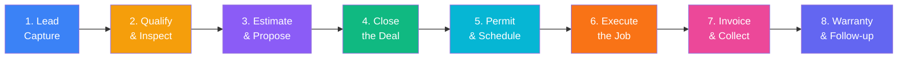

# Rise Up Roofing — Custom CRM Specification

A purpose-built CRM designed around how a roofing company actually operates — from the moment a lead comes in to the final warranty follow-up. No clutter, no features you'll never use. Unlike Salesforce or HubSpot, everything maps directly to the roofing business lifecycle.

## Why Build Custom Instead of Using Salesforce/HubSpot?

| Problem with off-the-shelf CRMs | Our custom solution |
|---|---|
| Generic "deal" pipelines — not roofing-specific | Pipeline stages match your actual workflow: Lead → Inspect → Estimate → Close → Permit → Install → Collect |
| Expensive per-seat licensing (\$25–\$150/user/mo) | Built into your existing site — zero licensing cost |
| Training overhead — employees need prior CRM experience | Built for YOUR team, uses YOUR terminology |
| Cluttered with 200+ features you never touch | Only the features Rise Up actually needs |
| Can't integrate with your existing lead capture | Already connected — leads flow straight from your website forms |
| Generic reporting | Reports that answer roofing questions: close rate by service type, revenue per city, crew productivity |

---

## The Roofing Business Lifecycle

This CRM is structured around 8 stages that every roofing job moves through:



---

## Module Breakdown

### Module 1: Enhanced Lead Management (Upgrade what you already have)

**What you have now:** A flat leads table with name, phone, email, status dropdown (new/contacted/quoted/won/lost).

**What you need:**

#### 1a. Lead Source Tracking
Know WHERE every lead came from so you know what's actually working:

| Source | How it's captured |
|---|---|
| Website Estimate Form | Already tracked via `source_page` |
| Website Contact Form | Already tracked |
| Phone Call (inbound) | Manual entry — "Add Lead" button in admin |
| Door Knocker | Sales rep selects source = "door knock" + enters rep name |
| Referral | Source = "referral" + who referred them |
| Repeat Customer | Link to existing customer record |
| Google Ads | UTM parameters already captured in analytics |
| Yelp / Google Business | Manual entry with source tag |
| Home Show / Event | Source = "event" + event name |

#### 1b. Property Information (critical for roofing)
Every lead should capture property details that matter for estimating:

- **Roof type:** Tile (concrete/clay), Shingle (architectural/3-tab), Flat (TPO/modified bitumen/coating), Metal, Wood shake
- **Stories:** 1, 2, 3+
- **Approximate square footage** (SQF) — this is the #1 factor in pricing
- **Roof age** (years) — helps qualify urgency
- **HOA?** Yes/No — affects material/color restrictions
- **Property type:** Single family, Condo, Townhome, Commercial, Multi-unit

#### 1c. Lead Priority / Scoring
Auto-score leads so the team knows who to call first:

| Factor | Points |
|---|---|
| Emergency/leak repair | +50 |
| Full reroof (high ticket) | +30 |
| Submitted estimate form (high intent) | +20 |
| Left phone number | +15 |
| In primary service area (Escondido, Oceanside, Carlsbad, San Marcos) | +10 |
| Submitted during business hours | +5 |
| Repeat customer | +25 |
| Referral | +20 |

Display as: 🔴 Hot (70+) | 🟡 Warm (30-69) | 🔵 Cool (0-29)

#### 1d. Activity Timeline
Every lead gets a timeline showing everything that happened:

```
📞 Sep 4, 2:30 PM — Outbound call (2 min 15 sec) — Spoke with homeowner, 
   scheduled inspection for Sep 6 at 10 AM — [Sales Rep: Mike]
📝 Sep 4, 2:15 PM — Lead submitted estimate form from homepage
   Service: Residential Roofing | SQF: 2,000-3,500 | City: Escondido
🌐 Sep 4, 2:12 PM — Visited services page (mobile, Google organic)
```

Types of timeline entries:
- **System-generated:** Form submission, page visits, call clicks
- **Manual entries:** Phone calls (with duration & notes), texts sent, emails sent, in-person visits, inspection notes
- **Status changes:** Pipeline stage transitions with who changed it and when

#### 1e. Follow-up Tasks & Reminders
- When a lead status changes to "contacted," auto-create a follow-up task for 24 hours later
- When a lead is "quoted," auto-create a follow-up task for 48 hours
- Manual task creation: "Call back Thursday at 3 PM about shingle color selection"
- Overdue tasks show a red badge on the sidebar
- Daily digest view: "Today's follow-ups" as the first thing the team sees

---

### Module 2: Estimating & Proposals

**What you have now:** Nothing — estimates are done externally or on paper.

#### 2a. Estimate Builder
A structured form that calculates job cost:

**Inputs:**
- Roof squares (1 square = 100 sq ft) — derived from SQF
- Roof pitch/slope (4:12 to 12:12) — affects labor difficulty multiplier
- Stories — affects labor rate
- Material selection (with cost per square):
  - Owens Corning Duration (architectural shingle) — \$X/sq
  - Concrete tile (Eagle Roofing) — \$X/sq  
  - Clay tile — \$X/sq
  - TPO single-ply (commercial) — \$X/sq
  - Standing seam metal — \$X/sq
- Tear-off layers (1 layer, 2 layers, overlay)
- Add-ons checklist:
  - [ ] New plywood/decking (\$X per sheet)
  - [ ] Dry rot repair (estimated LF)
  - [ ] New gutters (\$X per LF)
  - [ ] Skylights (quantity)
  - [ ] Ridge vents / ventilation
  - [ ] Solar detach & reset (\$X per panel)
  - [ ] Fascia board replacement
  - [ ] Permit fees
  - [ ] Dumpster / haul-away

**Outputs:**
- Material cost total
- Labor cost total  
- Overhead & profit margin (configurable %)
- **Total job price**
- Monthly financing amount (0% APR over 12/24/36/60 months)

#### 2b. Proposal Generation
Generate a clean, branded PDF or shareable link:

- Rise Up logo + license number + contact info
- Customer name & property address
- Itemized scope of work
- Material specifications with manufacturer warranty info
- Total price + financing options
- Terms & conditions
- Digital signature / acceptance button
- Proposal expiration date (e.g., valid for 30 days)

#### 2c. Proposal Tracking
- Track when the customer opens/views the proposal (if sent as a link)
- Track how many proposals are out and their total pipeline value
- Follow-up reminder if proposal not viewed within 48 hours

---

### Module 3: Job Management (After the deal closes)

**What you have now:** Nothing — once a lead is "won" it just sits there.

#### 3a. Job Board (Kanban View)
When a lead status hits "won," it converts into a **Job** with its own pipeline:

```
Permit Pending → Material Order → Scheduled → In Progress → Punch List → Final Inspection → Complete
```

Each job card shows:
- Customer name & address
- Service type & total contract value
- Scheduled start date
- Assigned crew
- Days until start (or days in progress)

#### 3b. Job Details Page
Everything about an active job in one place:

- **Customer info** (linked from the original lead)
- **Contract value & payment status** (deposit received? progress payment? final?)
- **Permit status:** Not filed / Filed / Approved / Inspection scheduled / Passed
- **Material order status:** Not ordered / Ordered / Delivered / On-site
- **Crew assignment:** Lead installer + crew members
- **Schedule:** Start date, estimated duration (days), end date
- **Weather notes:** Flag rain days, delays
- **Job photos:** Before, during, after — organized by phase
- **Daily log entries:** What was done each day on-site
- **Inspection results:** City inspector notes, pass/fail

#### 3c. Simplified Crew Management
Not full HR — just enough to assign and schedule:

- Crew roster: Name, phone, role (lead installer, laborer, foreman)
- Availability calendar: Who's booked on what job and when
- Simple assignment: Drag crew members onto job cards

---

### Module 4: Customer Communication Hub

**What you have now:** No communication tracking — calls/texts happen on personal phones with no record.

#### 4a. Communication Log
Every interaction with a customer logged in one timeline:
- Phone calls (manual log: who called, duration, outcome, notes)
- Text messages (manual log or future SMS integration)
- Emails sent
- In-person meetings / site visits
- Proposal sent / viewed / signed

#### 4b. Quick-Action Templates
Pre-written message templates the team can copy/customize:

- **After lead submission:** "Hi [Name], thanks for reaching out to Rise Up Roofing! I'm [Rep], and I'd love to schedule a free inspection at [Address]. Would [Day] at [Time] work for you?"
- **After inspection:** "Great meeting you today! I'll have your detailed estimate ready within 24 hours. Any questions, call me direct at..."
- **Proposal follow-up:** "Hi [Name], just checking in — did you get a chance to review the estimate I sent over for your [Service] project?"
- **Job scheduled:** "Your roofing project is confirmed for [Date]! Our crew will arrive between 7-8 AM. Here's what to expect..."
- **Job complete:** "Your new roof is looking great! If you have a moment, a Google review would mean a lot to our small team: [link]"
- **Warranty check-in (6 months):** "Hi [Name], it's been 6 months since we completed your roof. How's everything holding up?"

#### 4c. Review Request Automation
After a job hits "Complete":
- Auto-create a task: "Send review request to [Customer]" with pre-filled Google/Yelp review links
- Track which customers left reviews

---

### Module 5: Financial Tracking

**What you have now:** Nothing — financials are tracked separately.

#### 5a. Payment Milestones Per Job
Standard roofing payment structure:

| Milestone | Typical % | Status |
|---|---|---|
| Deposit (on contract signing) | 10-33% | ⬜ Not received / ✅ Received |
| Material delivery | 30-40% | ⬜ / ✅ |
| Job completion | Remaining balance | ⬜ / ✅ |

- Track payment method: Check, Credit Card, Financing, Cash
- Flag overdue payments with days outstanding

#### 5b. Revenue Dashboard
- Monthly revenue (closed jobs)
- Pipeline value (open estimates)
- Average job size by service type
- Revenue by city/area
- Close rate: Estimates sent vs. Jobs won
- Revenue per lead source (know your ROI)

---

### Module 6: Reporting & Insights

**What you have now:** Basic visitor/lead/call KPIs on the dashboard.

#### 6a. Sales Reports
- **Pipeline report:** How many leads at each stage, total value at each stage
- **Close rate:** By service type, by sales rep, by lead source, by city
- **Average days to close:** From lead submission to contract signed
- **Lost deal reasons:** Track why leads didn't close (price, timing, went with competitor, no response)

#### 6b. Operations Reports  
- **Jobs in progress:** Count, total value, average duration
- **Crew utilization:** How many days each crew worked this month
- **Permit timeline:** Average days from filing to approval by city

#### 6c. Marketing ROI
- **Cost per lead by source** (when ad spend is entered)
- **Lead-to-close rate by source**
- **Revenue per source**
- **Best performing pages** (already have this data)

---

## Database Schema (New Tables)

> [!IMPORTANT]
> These tables extend the existing Neon PostgreSQL database. The existing `leads`, `analytics_events`, `call_events`, and `admin_sessions` tables remain unchanged.

### New Tables

```sql
-- Extend leads table with new columns
ALTER TABLE leads ADD COLUMN IF NOT EXISTS
  assigned_to TEXT,
  lead_score INTEGER DEFAULT 0,
  lead_source TEXT DEFAULT 'website',
  property_type TEXT,
  roof_type TEXT,
  roof_sqf INTEGER,
  roof_age INTEGER,
  stories INTEGER,
  hoa BOOLEAN DEFAULT false,
  priority TEXT DEFAULT 'cool',
  last_contact_at TIMESTAMPTZ,
  follow_up_at TIMESTAMPTZ,
  lost_reason TEXT;

-- Activity timeline for any entity (lead or job)
CREATE TABLE activities (
  id SERIAL PRIMARY KEY,
  entity_type TEXT NOT NULL,        -- 'lead' | 'job'
  entity_id INTEGER NOT NULL,
  activity_type TEXT NOT NULL,      -- 'call' | 'email' | 'text' | 'note' | 'visit' | 'status_change' | 'system'
  title TEXT NOT NULL,
  description TEXT,
  performed_by TEXT,                -- team member name
  call_duration INTEGER,            -- seconds, for calls
  metadata JSONB,
  created_at TIMESTAMPTZ DEFAULT NOW()
);

-- Tasks / follow-up reminders
CREATE TABLE tasks (
  id SERIAL PRIMARY KEY,
  entity_type TEXT,                 -- 'lead' | 'job' | null (general)
  entity_id INTEGER,
  title TEXT NOT NULL,
  description TEXT,
  assigned_to TEXT,
  due_at TIMESTAMPTZ NOT NULL,
  completed_at TIMESTAMPTZ,
  priority TEXT DEFAULT 'normal',   -- 'low' | 'normal' | 'high' | 'urgent'
  created_at TIMESTAMPTZ DEFAULT NOW()
);

-- Estimates / proposals
CREATE TABLE estimates (
  id SERIAL PRIMARY KEY,
  lead_id INTEGER REFERENCES leads(id),
  estimate_number TEXT UNIQUE,      -- 'EST-2026-0042'
  version INTEGER DEFAULT 1,
  status TEXT DEFAULT 'draft',      -- 'draft' | 'sent' | 'viewed' | 'accepted' | 'declined' | 'expired'
  roof_squares NUMERIC(6,2),
  roof_pitch TEXT,
  stories INTEGER,
  tearoff_layers INTEGER DEFAULT 1,
  material_type TEXT,
  material_cost NUMERIC(10,2),
  labor_cost NUMERIC(10,2),
  addons JSONB,                     -- [{name, quantity, unit_cost, total}]
  subtotal NUMERIC(10,2),
  margin_pct NUMERIC(5,2),
  total NUMERIC(10,2),
  financing_months INTEGER,
  monthly_payment NUMERIC(10,2),
  valid_until DATE,
  notes TEXT,
  sent_at TIMESTAMPTZ,
  viewed_at TIMESTAMPTZ,
  accepted_at TIMESTAMPTZ,
  signature_data TEXT,              -- base64 signature image
  created_at TIMESTAMPTZ DEFAULT NOW(),
  updated_at TIMESTAMPTZ DEFAULT NOW()
);

-- Jobs (post-sale project management)
CREATE TABLE jobs (
  id SERIAL PRIMARY KEY,
  lead_id INTEGER REFERENCES leads(id),
  estimate_id INTEGER REFERENCES estimates(id),
  job_number TEXT UNIQUE,           -- 'JOB-2026-0042'
  status TEXT DEFAULT 'permit_pending',
  -- 'permit_pending' | 'material_order' | 'scheduled' | 'in_progress' | 'punch_list' | 'final_inspection' | 'complete'
  customer_name TEXT NOT NULL,
  customer_phone TEXT,
  customer_email TEXT,
  address TEXT,
  city TEXT,
  zip TEXT,
  service_type TEXT,
  contract_value NUMERIC(10,2),
  permit_status TEXT DEFAULT 'not_filed',
  permit_number TEXT,
  permit_filed_at DATE,
  permit_approved_at DATE,
  material_status TEXT DEFAULT 'not_ordered',
  material_ordered_at DATE,
  material_delivered_at DATE,
  crew_lead TEXT,
  crew_members TEXT[],              -- array of names
  scheduled_start DATE,
  estimated_days INTEGER,
  actual_start DATE,
  actual_end DATE,
  weather_delays INTEGER DEFAULT 0,
  notes TEXT,
  created_at TIMESTAMPTZ DEFAULT NOW(),
  updated_at TIMESTAMPTZ DEFAULT NOW()
);

-- Payment tracking
CREATE TABLE payments (
  id SERIAL PRIMARY KEY,
  job_id INTEGER REFERENCES jobs(id),
  milestone TEXT NOT NULL,          -- 'deposit' | 'material' | 'completion' | 'other'
  amount NUMERIC(10,2) NOT NULL,
  method TEXT,                      -- 'check' | 'card' | 'financing' | 'cash' | 'zelle'
  status TEXT DEFAULT 'pending',    -- 'pending' | 'received' | 'overdue'
  due_at DATE,
  received_at DATE,
  notes TEXT,
  created_at TIMESTAMPTZ DEFAULT NOW()
);

-- Crew members
CREATE TABLE crew_members (
  id SERIAL PRIMARY KEY,
  name TEXT NOT NULL,
  phone TEXT,
  role TEXT,                        -- 'foreman' | 'lead_installer' | 'laborer' | 'sales'
  active BOOLEAN DEFAULT true,
  created_at TIMESTAMPTZ DEFAULT NOW()
);

-- Job photos
CREATE TABLE job_photos (
  id SERIAL PRIMARY KEY,
  job_id INTEGER REFERENCES jobs(id),
  phase TEXT,                       -- 'before' | 'during' | 'after' | 'inspection' | 'damage'
  url TEXT NOT NULL,
  caption TEXT,
  uploaded_by TEXT,
  created_at TIMESTAMPTZ DEFAULT NOW()
);

-- Message templates
CREATE TABLE templates (
  id SERIAL PRIMARY KEY,
  name TEXT NOT NULL,
  category TEXT,                    -- 'lead_followup' | 'proposal' | 'scheduling' | 'completion' | 'review_request'
  body TEXT NOT NULL,
  created_at TIMESTAMPTZ DEFAULT NOW()
);
```

---

## New Admin Pages / Routes

| Route | Purpose |
|---|---|
| `/admin/leads` | **Enhanced** — Add property fields, lead scoring badges, activity timeline drawer, "Add Lead" button, follow-up indicators |
| `/admin/leads/[id]` | **NEW** — Full lead detail page with timeline, property info, linked estimates, tasks, communication log |
| `/admin/estimates` | **NEW** — List all estimates with status filters, pipeline value summary |
| `/admin/estimates/new?lead_id=X` | **NEW** — Estimate builder form with cost calculator |
| `/admin/estimates/[id]` | **NEW** — Estimate detail, PDF preview, send to customer, track views |
| `/admin/jobs` | **NEW** — Kanban board of active jobs by stage |
| `/admin/jobs/[id]` | **NEW** — Job detail: schedule, crew, permits, payments, photos, daily log |
| `/admin/tasks` | **NEW** — Today's follow-ups, overdue tasks, task calendar view |
| `/admin/crew` | **NEW** — Crew roster, availability, job assignments |
| `/admin/finances` | **NEW** — Revenue dashboard, payment tracking, pipeline value |
| `/admin/templates` | **NEW** — Manage message templates for quick copy/paste |
| `/admin/reports` | **NEW** — Sales reports, close rates, marketing ROI |

---

## Updated Admin Sidebar Navigation

```
📊 Dashboard          (existing, enhanced)
👥 Leads              (existing, enhanced)  
📋 Tasks              (NEW — today's follow-ups)
💰 Estimates          (NEW)
🔨 Jobs               (NEW — active projects)
👷 Crew               (NEW)
💵 Finances           (NEW)
📞 Calls              (existing)
📈 Analytics          (existing)
📊 Reports            (NEW)
⚙️ Settings           (existing, add template management)
```

---

## User Review Required

> [!IMPORTANT]
> **Phased Rollout Recommended:** This is a significant feature set. I recommend building it in 3 phases:
> 
> **Phase 1 (Core — build first):** Enhanced leads + activity timeline + tasks/follow-ups + lead detail page
> 
> **Phase 2 (Revenue — build second):** Estimate builder + proposal generation + job management kanban
> 
> **Phase 3 (Operations — build third):** Payment tracking + crew management + reports + templates
> 
> Each phase is independently useful. Phase 1 alone would be a massive upgrade over what you have today.

> [!WARNING]
> **Pricing Data:** The estimate builder needs your actual material costs, labor rates, and margin percentages. I've designed the structure, but you'll need to provide the real numbers or I can use the ballpark ranges already in your InteractiveHeroEstimator as starting defaults.

## Open Questions

1. **Who uses the admin panel?** Is it just you (the owner), or do sales reps and office staff also need access? This affects whether we need user roles & permissions (admin vs sales rep vs read-only).

2. **How do you currently track estimates?** Paper? Excel? Another app? This tells me how detailed the estimate builder needs to be on day one.

3. **Do you want customer-facing proposal links?** (Customer receives a link, views the estimate online, can digitally sign to accept) — or is PDF/email enough for now?

4. **Photo uploads:** Do you want to upload job photos directly in the CRM, or is linking to Google Drive/Dropbox folders sufficient?

5. **Which phase do you want to start with?** I recommend Phase 1 (enhanced leads + timeline + tasks) since it builds directly on what you already have.

## Verification Plan

### Automated Tests
- API route tests for all new endpoints (leads CRUD, estimates, jobs, tasks, payments)
- Database migration validation — ensure all tables create correctly on Neon
- Lead scoring calculation tests

### Manual Verification
- Walk through the full lifecycle: create lead → add notes → build estimate → convert to job → track payments → mark complete
- Test on mobile (your team likely uses phones in the field)
- Verify CSV export still works with new lead fields
- Test with real-world data from your existing leads
